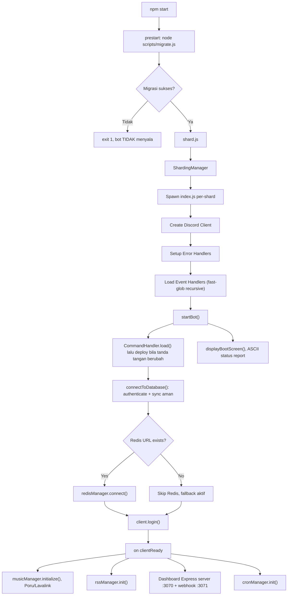
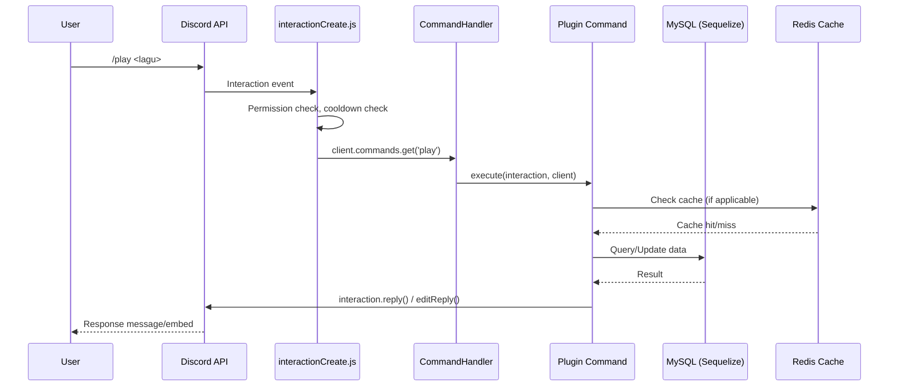
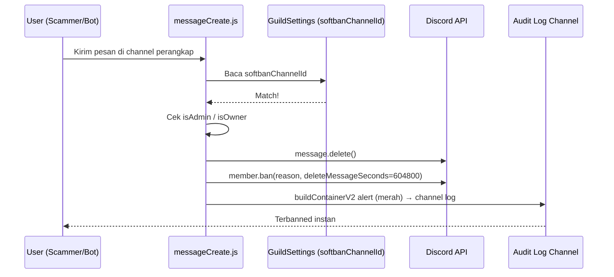

# 🌸 NAURA HOSHINO, Agent Governance & Architecture Guide

> **Versi:** 2.0.0 · **Engine:** 2.0.0 · **Runtime:** Node.js ≥ 24 · **Framework:** discord.js v14

> [!IMPORTANT]
> **Sumber kebenaran.** `package.json` adalah sumber kebenaran untuk versi dan daftar dependensi. `src/config/env.js` adalah sumber kebenaran untuk variabel environment. GitHub Issues adalah sumber kebenaran untuk pekerjaan yang sedang berjalan. `TODO.md` adalah sumber kebenaran untuk prioritas sprint. Dokumen ini berisi **aturan** yang tidak berubah tiap rilis. Bila ada tabel di dokumen ini yang bertentangan dengan file-file di atas, file itulah yang menang, dan tabel di sini harus diperbarui.

### Keputusan arsitektur yang sudah dikunci

| Topik              | Keputusan                                                                                                                                                                       |
| ------------------ | ------------------------------------------------------------------------------------------------------------------------------------------------------------------------------- |
| Versi Node         | `>= 24` di `engines`, README, dokumen ini, dan CI. Seragam, tanpa pengecualian.                                                                                                 |
| Versi bot & engine | Keduanya `2.0.0`, dan harus sama di `package.json`, `README.md`, serta default `BOT_VERSION`/`ENGINE_VERSION`.                                                                  |
| Penyimpanan bahasa | **Per user.** `GuildSettings.language` hanya menjadi bahasa default saat user belum punya preferensi.                                                                           |
| Strategi sharding  | Tetap `ShardingManager` untuk sekarang, tetapi seluruh kode baru wajib siap migrasi ke clustering. Lihat aturan 1.11.                                                           |
| Fallback SQLite    | **Dipertahankan** sebagai penyimpanan darurat saat MySQL dan Redis mati bersamaan.                                                                                              |
| Alur PR            | **Satu PR per sprint.** Seluruh pekerjaan satu sprint menumpuk di satu branch, direview dan di-merge sekali saat sprint tuntas.                                                 |
| Deploy di panel    | **Pterodactyl.** Perintah luar terkunci, jadi `CMD_RUN` tetap `npm start` dan urutan migrasi dijamin dari dalam `package.json` lewat `prestart`. Lihat 3.8.                     |
| Mata uang kupon    | **Naura Coupon adalah mata uang paling langka.** Disimpan di kolom `UserSurvival.coupons`, bukan di dalam JSON `rpg_state`, agar bisa dipotong secara atomik.                   |
| Prioritas kerja    | Sprint 0-10 sudah tuntas (Hardening, Fondasi DX, Konsistensi Data, Observabilitas, Ticketing, Gacha, Giveaway V2, Setup Dashboard Modular). Sprint berikutnya dipilih dari backlog `TODO.md`. |

---

## Daftar Isi

1. [File Aturan & Instruksi Global (Governance)](#-bagian-1--aturan--instruksi-global-governance)
2. [File Arsitektur & Rencana Kerja (Map)](#-bagian-2--arsitektur--rencana-kerja-map)
3. [File Proyek & Environment (Context)](#-bagian-3--proyek--environment-context)

---

# 📜 BAGIAN 1, Aturan & Instruksi Global (Governance)

## 1.1 Bahasa & Konvensi Kode

| Aturan              | Penjelasan                                                                                                                                            |
| ------------------- | ----------------------------------------------------------------------------------------------------------------------------------------------------- |
| **Bahasa Kode**     | JavaScript (CommonJS `require`/`module.exports`). Tidak menggunakan TypeScript atau ESM.                                                              |
| **Dynamic import**  | `await import()` **diizinkan dan dianjurkan** untuk lazy-load dependensi berat, meski proyek memakai CommonJS. Ini bukan pelanggaran aturan CommonJS. |
| **Bahasa Komentar** | Bahasa Indonesia untuk komentar inline dan log. Bahasa Inggris hanya untuk nama variabel, fungsi, dan kelas.                                          |
| **Indentasi**       | 4 spasi. Nilai ini harus sama dengan konfigurasi Prettier di repo; bila berbeda, konfigurasi Prettier yang menang dan baris ini diperbarui.           |
| **Linting**         | ESLint v10 + Prettier v3. Jalankan sebelum commit.                                                                                                    |
| **Testing**         | `node:test` bawaan Node, dijalankan lewat `npm test`. Tidak menambah framework test eksternal.                                                        |
| **Semicolons**      | Wajib digunakan di setiap statement.                                                                                                                  |
| **String**          | Gunakan single quotes (`'...'`) untuk string biasa, backticks (`` `...` ``) untuk template literals.                                                  |
| **Em dash**         | Dilarang di seluruh repo, termasuk kamus bahasa. CI memeriksa ini lewat `scripts/check-em-dash.js`.                                                   |

## 1.2 Aturan Penamaan

| Elemen                 | Pola                                                  | Contoh                                             |
| ---------------------- | ----------------------------------------------------- | -------------------------------------------------- |
| File command/plugin    | `kebab-case.js`                                       | `steal-emoji.js`, `warn.js`                        |
| File manager/utility   | `camelCase.js`                                        | `cronManager.js`, `bootScreen.js`                  |
| File model (Sequelize) | `PascalCase.js`                                       | `UserProfile.js`, `GuildSettings.js`               |
| File builder/utility   | `PascalCase.js`                                       | `NauraContainerBuilder.js`, `NauraEmbedBuilder.js` |
| Variabel & fungsi      | `camelCase`                                           | `cleanEnv()`, `buildContainerV2()`                 |
| Kelas & model          | `PascalCase`                                          | `CommandHandler`, `MusicManager`                   |
| Konstanta global       | `UPPER_SNAKE_CASE`                                    | `OWNER_IDS`, `LAVA_HOST`                           |
| Event handler files    | `camelCase.js` (nama event Discord)                   | `messageCreate.js`, `voiceStateUpdate.js`          |
| File test              | `<nama>.test.js`, bersebelahan dengan file yang diuji | `rateLimiter.test.js`, `inventoryHelper.test.js`   |

## 1.3 Aturan Arsitektur

> [!IMPORTANT]
> Patuhi prinsip-prinsip ini saat menambah atau mengubah kode:

1. **Modularitas Plugin**, Setiap fitur command harus berada di folder `/plugin/<kategori>/`. Jangan pernah menulis logic command di dalam file event handler.
2. **Model Terpisah**, Semua definisi Sequelize model HARUS berada di `/src/models/`. Jangan mendefinisikan schema di dalam command atau manager.
3. **Satu File = Satu Tanggung Jawab**, Manager hanya mengelola satu domain (misal: `cronManager.js` hanya untuk cron, `redisManager.js` hanya untuk Redis).
4. **Environment Via `env.js`**, Semua akses `process.env` HARUS melalui `/src/config/env.js`. Jangan pernah memanggil `process.env.XXX` langsung di file lain.
5. **Anti-Crash Wajib**, Setiap operasi async yang berisiko (API call, Canvas render, DB query) harus di-wrap dalam `try/catch`. Global error handler sudah ada di `/src/managers/errorHandler.js`. Ini berlaku untuk **semua** tipe interaksi, termasuk tombol, select menu, modal, dan autocomplete.
6. **Canvas Memory Safety**, Setelah merender canvas (via `@napi-rs/canvas`), pastikan buffer di-dispose untuk mencegah memory leak.
7. **Jangan Hardcode ID**, Channel ID, role ID, dan guild ID harus disimpan di `/src/config.json` atau `GuildSettings` model, bukan di-hardcode dalam kode.
8. **Setup Modular**, `plugin/admin/setup.js` adalah **router** (satu-satunya entry point `/setup`). Setiap subcommand ditangani oleh file terpisah di `plugin/admin/setup/<modul>.js` (satu file per modul). Handler menerima `(interaction, { currentSettings, saveSettings }, subcommand)`. Jangan menulis logic command langsung di dalam `setup.js`.
9. **Softban Channel via GuildSettings**, Channel Honeypot Scammer Trap disimpan di `GuildSettings.settings.softbanChannelId`. Pengecekan dilakukan paling awal di `messageCreate.js` sebelum proses lain.
10. **Layout Components V2 Wajib**, Setiap Container V2 (baik via `buildContainerV2()` maupun manual) HARUS mengikuti struktur 5-lapisan:
    ```
    [ Header ]
    ───────── separator (divider:true) ─────────
    [ Deskripsi / Fields / Media Gallery ]
    ··········· separator (divider:false) ··········
    [ Select Menu / Tombol ]
    ───────── separator (divider:true) ─────────
    [ Footer ]
    ```
11. **Batas Payload Discord Wajib Dihormati**, Struktur 5-lapisan menambah komponen di setiap respons, jadi container panjang mudah menembus batas Discord. Lihat aturan 1.12.
12. **Kepemilikan Tidak Boleh Diturunkan dari Data yang Bisa Dipalsukan**, Kepemilikan (misal owner Temp Voice) harus disimpan eksplisit di store, bukan diturunkan dari nama channel, topik, atau teks pesan yang bisa diubah user.
13. **Sentralisasi Versi & Smart Canvas Invalidation**, Nilai `BOT_VERSION` dan `ENGINE_VERSION` bersumber eksklusif dari `.env` dan diakses melalui `src/config/env.js`. Seluruh cache visual Canvas di Redis (`canvas:*`) wajib terhubung ke `smartInvalidateUserCanvas(userId)` pada setiap event mutasi profil/saldo/leveling.

## 1.4 Aturan Commit & Branching

| Aturan             | Detail                                                                                                                          |
| ------------------ | ------------------------------------------------------------------------------------------------------------------------------- |
| Format commit      | `<emoji> <tipe>: <deskripsi singkat>` contoh: `✨ feat: tambah command /weather`                                                |
| Tipe commit        | `feat`, `fix`, `refactor`, `docs`, `style`, `perf`, `chore`, `test`, `ci`                                                       |
| Branching          | `main` untuk produksi, `dev` untuk development, `feature/<nama>` untuk fitur baru                                               |
| Satu PR per sprint | Seluruh commit satu sprint dikumpulkan di satu branch `feature/<nama-sprint>`, direview dan di-merge sekali saat sprint tuntas. |
| Referensi issue    | Setiap PR yang mengerjakan item `TODO.md` wajib menyebut nomor issue terkait di deskripsi.                                      |
| CI wajib hijau     | `lint`, `check-em-dash`, `locales:check:strict`, dan `npm test` harus lulus sebelum merge.                                      |

## 1.5 Aturan Keamanan

> [!CAUTION]
> Pelanggaran aturan keamanan ini bisa menyebabkan kebocoran data pengguna atau kebocoran pendapatan.

- **JANGAN PERNAH** meng-commit file `.env` ke repository.
- **JANGAN PERNAH** log-kan token, password, atau API key ke console.
- Semua webhook endpoint (`/api/webhook/*`) HARUS memverifikasi `Authorization` header terhadap `WEBHOOK_AUTH_SAWERIA`, `WEBHOOK_AUTH_TRAKTEER`, atau `WEBHOOK_AUTH_VOTE` sesuai penyedianya.
- **Perbandingan token wajib memakai `crypto.timingSafeEqual`**, bukan `===`. Perbandingan string biasa membocorkan informasi lewat waktu eksekusi.
- **Tolak request bila token belum dikonfigurasi.** Konfigurasi kosong tidak boleh berarti akses terbuka; endpoint harus membalas `503`.
- **Webhook yang memberi keuntungan (premium, saldo, vote) WAJIB idempoten.** Simpan idempotency key per transaksi agar retry dari penyedia tidak memberi hadiah dua kali.
- **Setiap pemberian premium wajib tercatat di audit log.**
- **`OWNER_EVAL_ENABLED` wajib `false` di produksi.** Rute `eval` hanya dinyalakan sementara saat debugging, lalu dimatikan kembali.
- Rate limiting aktif via `rateLimiter.js`, jangan bypass tanpa alasan kuat. Balasan rate limit wajib menyertakan `retryAfter`.
- Validasi semua input user sebelum diproses (terutama untuk command yang menerima URL atau text panjang), dan batasi ukuran body pada endpoint HTTP.
- **Konten dari server pengguna adalah input tidak terpercaya.** Saat konten itu masuk ke prompt AI, perlakukan sebagai data, bukan instruksi.

## 1.6 Panduan Desain UI/UX (Style Guide)

### Identitas Visual

Naura Hoshino menggunakan identitas **Cyber-Anime Glassmorphism**, gabungan estetika anime kawaii dengan antarmuka futuristik. Referensi lengkap ada di `DESIGN.md`.

### Palet Warna Utama

| Token             | Hex                      | Fungsi                                        |
| ----------------- | ------------------------ | --------------------------------------------- |
| `primary`         | `#FFB6C1`                | Identitas brand, border panel kaca, glow text |
| `canvas`          | `#0B0C10`                | Background terdalam (hitam kebiruan)          |
| `accent-pink`     | `#F9A8D4`                | Metrik ping & latensi                         |
| `accent-purple`   | `#C084FC`                | Jaringan server, guild stats                  |
| `accent-blue`     | `#93C5FD`                | Demografi user                                |
| `accent-green`    | `#86EFAC`                | Uptime, status aktif                          |
| `premium-gold`    | `#FFD700`                | Sistem premium/VIP, ekonomi                   |
| `discord-blurple` | `#5865F2`                | Tombol OAuth2, link Discord                   |
| `surface-glass`   | `rgba(255,255,255,0.03)` | Panel glassmorphism (+ `blur(16px)`)          |

### Tipografi

| Konteks                     | Font                 | Contoh Penggunaan          |
| --------------------------- | -------------------- | -------------------------- |
| Angka metrik, nama sistem   | **Orbitron** (700)   | Ping: `42ms`, total server |
| Body text, navigasi, tombol | **Outfit** (300–700) | Deskripsi, label, button   |

### Aturan Canvas (@napi-rs/canvas)

- Kartu level & rank → Glassmorphism + Neon Glow
- Now Playing → Dynamic image canvas real-time
- Profile card → Gold glow untuk VIP
- Selalu gunakan `rounded-lg` minimum (12px). Tidak ada sudut tajam.
- Dispose buffer setelah render selesai.
- **Batasi konkurensi render** ke 2 sampai 3 secara global. Canvas adalah operasi paling mahal di bot ini.
- Cache hasil `loadImage()` dan font yang dipakai berulang.

### Aturan Components V2 (Discord)

> [!IMPORTANT]
> Semua respons command WAJIB menggunakan **Discord Components V2** via `buildContainerV2()` dari `NauraContainerBuilder.js`. Embed lama (`NauraEmbedBuilder` / `EmbedBuilder`) hanya diperbolehkan untuk pesan loading sementara dan error sederhana.

#### Struktur Layout Wajib

Setiap Container V2 harus mengikuti struktur 5-lapisan berikut:

```
[ Header (authorName + title + iconURL) ]
───────── separator (divider:true, spacing:1) ─────────
[ Deskripsi / Fields / Media Gallery / File ]
··········· separator (divider:false, spacing:1) ···········
[ Select Menu / Action Row (Tombol) ]
───────── separator (divider:true, spacing:1) ─────────
[ -# Footer ]
```

> [!NOTE]
> **`buildContainerV2()` sudah menerapkan struktur ini secara otomatis.** Footer **SELALU** muncul, jika `footerText` tidak diisi, diisi otomatis dengan `ui.getFooter('core')`. Blok separator tipis + tombol hanya muncul jika ada `buttonsRow` yang valid.

#### Aturan Lainnya

- **Gunakan `buildContainerV2()`** dari `/src/utils/NauraContainerBuilder.js` sebagai standar UI utama.
- **Wajib sertakan `flags: MessageFlags.IsComponentsV2`** (nilai `32768`) di setiap payload Container V2.
- **Jangan pernah mengisi `content`, `embeds`, `stickers`, atau `poll`** pada payload Components V2. Discord menolak kombinasi tersebut.
- **Wajib sertakan `embeds: []`** saat meng-edit pesan lama (embed) ke Container V2, agar sisa embed lama dibersihkan oleh Discord PATCH API.
- **Pesan ephemeral wajib memakai `MessageFlags.Ephemeral`**, bukan `ephemeral: true` yang sudah deprecated. ESLint menolak pemakaian baru, dan monkey-patch tidak boleh dipakai sebagai solusi jangka panjang.
- **Custom emoji di `authorName` dan `footerText`** TIDAK didukung oleh Discord di bagian tersebut. Gunakan `ui.stripCustomEmojis()` sebelum mengisinya. Judul, deskripsi, dan field boleh menggunakan emoji kustom.
- **Footer Terpusat**, Gunakan `ui.getFooter('core' | 'utility' | 'survival' | 'music')` untuk footer semua embed/container. Jangan tulis teks footer secara manual.
- **Tombol dengan custom emoji**, Gunakan `ui.parseEmoji(ui.getEmoji('namaEmoji'))` yang mengembalikan `{ id, name, animated }` sebelum diberikan ke `ButtonBuilder.setEmoji()` agar tidak terjadi `RESTJSONError: Invalid Form Body`.
- **Container Manual (non-`buildContainerV2`)**, Jika membangun container secara manual (seperti `MusicUIManager.js`), WAJIB mengikuti struktur 5-lapisan di atas secara eksplisit menggunakan `separatorComp(true, 1)` dan `separatorComp(false, 1)` dari `NauraContainerBuilder.js`.
- **Satu aksi utama per Section.** Jangan menumpuk banyak tombol primary dalam satu blok.

### Aturan Embed Discord (Legacy)

- Hanya digunakan untuk pesan loading sementara dan error inline.
- Gunakan `NauraEmbedBuilder` dari `/src/utils/NauraEmbedBuilder.js` jika tetap diperlukan.
- Warna embed default: `#FFB6C1` (primary pink).
- Premium embed: `#FFD700` (gold).
- Error embed: gunakan warna merah standar Discord.

## 1.7 Aturan Migration & Database

> [!IMPORTANT]
> Pelanggaran aturan ini bisa menyebabkan schema yang tidak konsisten antara environment development dan production.

- **ALTER TABLE DILARANG di `dbManager.js`**, Semua migration kolom (`ADD COLUMN`, `MODIFY COLUMN`, `DROP COLUMN`, dll.) harus berada **eksklusif** di `dbMigrator.js` dengan sistem versi bernomor. Tidak boleh ada raw `sequelize.query('ALTER TABLE ...')` di dalam `connectToDatabase()`.
- **`sync({ alter: true })` DILARANG di production.** Produksi memakai `sync({ alter: false })`, development memakai `sync({ alter: { drop: false } })`. Perubahan kolom selalu lewat migrator.
- **Migrasi adalah langkah terpisah yang dijamin npm, bukan bagian dari boot.** Script `prestart` di `package.json` menjalankan `node scripts/migrate.js` sebelum `start`. Bila migrasi gagal, prosesnya keluar dengan kode 1 dan bot tidak pernah menyala, sehingga tidak mungkin berjalan di atas skema separuh jalan.
  - Jangan memindahkan `runMigrations()` kembali ke dalam `index.js`. Panel hosting hanya memberi satu perintah start, jadi `prestart` adalah satu-satunya tempat yang menjamin urutannya.
  - `SKIP_DB_MIGRATE` (`1`, `true`, atau `yes`) dan `npm run start:no-migrate` adalah pintu darurat. Keduanya tidak boleh menjadi konfigurasi permanen, karena migrasi baru akan terus dilewati secara diam-diam.
- **Hanya satu shard yang boleh menjalankan migrasi.** Karena migrasi kini berjalan sebagai proses terpisah sebelum `shard.js`, syarat ini terpenuhi otomatis. Jangan menambahkan jalur migrasi lain di dalam kode per shard.
- **Migrasi data yang menambah nilai wajib dijaga ledger.** `schema_migrations` adalah satu-satunya pengaman agar migrasi seperti `v6_move_coupons_to_column` tidak berjalan dua kali dan menggandakan saldo. Setiap migrasi data yang bersifat menambah wajib punya test yang membuktikan ia hanya berjalan sekali.
- **Seeding data awal** (CanvasAsset, GameItem, dll.) boleh tetap di `connectToDatabase()`, namun HARUS dipisah ke fungsi `seedInitialData()` yang dipanggil terpisah agar mudah di-test dan tidak bercampur dengan logic koneksi.
- **Gunakan `try/catch` per-migration** di `dbMigrator.js` dengan log yang jelas, bukan silent catch kosong (`catch (e) {}`).
- **Fallback SQLite wajib dipertahankan** sebagai penyimpanan darurat saat MySQL dan Redis mati bersamaan. Jangan menghapus jalur ini demi kerapian. Karena Node dipatok `>= 24`, jalur ini memakai `node:sqlite` bawaan.
- **Ukuran connection pool harus sadar shard.** Nilai `pool.max` berlaku per proses, jadi dikalikan jumlah shard. Jaga totalnya tetap di bawah `max_connections` MySQL.

## 1.8 Aturan Konsistensi Data (Ekonomi & Counter)

> [!CAUTION]
> Bug konsistensi data pada ekonomi tidak bisa dipulihkan tanpa reset. Ini kelas bug paling mahal di bot ini.

### Kolom numerik

- **DILARANG melakukan pola read-modify-write** untuk nilai numerik seperti `economy_wallet`, `economy_bank`, `starFragments`, `coupons`, `xp`, atau jumlah item. Dua interaksi yang datang hampir bersamaan (double-click tombol) akan saling menimpa dan menduplikasi nilai.
- **Gunakan operasi atomik**: `incrementUserProfile()` / `incrementUserSurvival()` untuk menambah, atau `Model.increment()`.
- **Untuk pengurangan saldo, gunakan `debitUserProfile()` / `debitUserSurvival()`.** Keduanya memakai penulisan bersyarat dengan `Op.gte` lalu memeriksa jumlah baris terpengaruh. Nol baris berarti saldo tidak cukup, dan itu bukan error yang boleh diabaikan.
- **Jangan pernah memercayai nilai saldo yang dibaca di awal handler** sebagai dasar penulisan di akhir handler.
- **Mata uang wajib berupa kolom, bukan isi JSON.** `Naura Coupon` sudah dipindahkan ke kolom `UserSurvival.coupons` demi alasan ini. Jangan menambah mata uang baru di dalam `rpg_state`.

### Kolom JSON

> Kolom JSON tidak punya padanan `kolom = kolom + delta`, jadi ia tidak bisa memakai `increment()`. Satu-satunya cara aman adalah mengunci barisnya.

- **Kolom JSON seperti `inventory`, `rpg_state`, `cooldowns`, `shop_purchases`, `economy_deposit`, dan `economy_investments` WAJIB diubah lewat `cacheManager.mutateUserProfileJson()` atau `mutateUserSurvivalJson()`.** Keduanya membuka transaksi, mengambil baris dengan `SELECT ... FOR UPDATE`, memberi mutator sebuah **salinan** nilainya, lalu menyimpan satu kolom saja dan menghapus cache.
- **Mutator boleh mengembalikan `null` atau `undefined` untuk membatalkan seluruh transaksi.** Inilah cara benar menolak pengambilan barang saat jumlahnya kurang, bukan dengan memeriksa lebih dulu lalu menulis kemudian.
- **Untuk inventory, pakai helper siap pakai** `addItemsAtomic(userId, items)` dan `takeItemsAtomic(userId, requests)` dari `plugin/survival/inventoryHelper.js`. Jangan menulis `profile.inventory` secara langsung dari plugin.
- **Jangan memanggil `Model.update()` atau `row.save()` langsung dari plugin** untuk kolom yang dikelola cache. Penulisan itu tidak menghapus cache, sehingga nilai lama masih tersaji sampai TTL habis.
- **`row.save()` wajib menyebut `fields` secara eksplisit.** Menyimpan seluruh baris akan menulis nilai in-memory ke kolom saldo yang sedang menunggu increment atomik di antrean flush, dan itu pernah menyebabkan bug kupon dobel. Contoh benar: `await survival.save({ fields: ['rpg_state'] });`.
- **Jangan pernah memanggil `save()` telanjang pada objek yang saldonya baru dinaikkan `currency.charge()` atau `currency.reward()`.** Kedua fungsi itu menaruh delta di antrean, jadi menyimpan nilai absolut akan membuat delta itu diterapkan dua kali.
- **Urutan yang benar saat memberi hadiah:** simpan barang lebih dulu, baru kurangi stamina atau biaya. Bila penulisan barang gagal, pemain tidak boleh kehilangan apa pun.

## 1.9 Aturan Memory Safety (Non-Canvas)

> [!CAUTION]
> In-memory Map yang tidak dibersihkan adalah sumber memory leak tersembunyi yang sulit di-debug.

- **Setiap `Map` atau `Set` yang dipakai sebagai in-memory store sementara WAJIB memiliki cleanup mechanism.** Ini berlaku untuk:
  - Rate limiter fallback (`inMemoryStore` di `rateLimiter.js`)
  - Snipe cache (`client.snipes`)
  - DM cooldown maps di event handler
  - Error dedup maps di `errorHandler.js`
- Gunakan salah satu strategi berikut:
  - `setInterval(() => { map.clear(); }, ttl_ms)` untuk full periodic clear
  - Loop selektif: hapus hanya entries yang sudah melewati TTL-nya
- Setiap Map yang dibuat sebagai modul-level constant (di luar class/function) WAJIB didokumentasikan kapan ia di-cleanup.
- **Setiap `setInterval` di level modul wajib dipanggil `.unref()`** agar tidak menahan proses saat shutdown.
- **Batasi cache discord.js** dengan `Options.cacheWithLimits`, dan jangan mengaktifkan intent yang tidak dipakai.

## 1.10 Aturan Caching & Invalidasi Wajib

> [!IMPORTANT]
> Query DB tanpa cache di event handler bervolume tinggi (messageCreate, interactionCreate) sangat membebani database. Sebaliknya, cache tanpa invalidasi membuat setting admin terasa tidak berfungsi.

- **`GuildSettings` WAJIB di-cache**, Karena `GuildSettings.findOne()` dipanggil di setiap `messageCreate` dan `interactionCreate`, query ini HARUS melewati `cacheManager.getGuildSettings()` atau `redisManager.getOrSetCache()` dengan TTL minimal 5 menit (300 detik).
- **Semua penulisan `GuildSettings` WAJIB lewat `guildSettingsService.updateGuildSetting()`.** Jangan menulis model langsung dari handler tombol, select menu, atau modal. Service inilah satu-satunya tempat yang menjamin `cacheManager.invalidateGuildSettings(guildId)` selalu terpanggil.
- **Invalidasi wajib menjangkau semua shard.** Cache di proses lain tidak ikut terhapus secara otomatis, jadi siarkan lewat channel Redis Pub/Sub `cache:invalidate`.
- **Jangan query DB di dalam loop**, Jika perlu data user/guild untuk banyak item sekaligus, gunakan `findAll` dengan `where: { id: { [Op.in]: listOfIds } }` lalu map hasilnya, bukan query satu per satu di dalam loop.
- **`UserProfile` sudah di-cache** via `cacheManager.getUserProfile()`, Selalu gunakan method ini, jangan `UserProfile.findByPk()` langsung di command kecuali ada alasan kuat.
- **Penulisan wajib lewat cacheManager juga.** `updateUserProfile()` / `updateUserSurvival()` untuk nilai absolut non-saldo, `increment*()` dan `debit*()` untuk angka, dan `mutate*Json()` untuk kolom JSON. Menulis model langsung akan meninggalkan cache basi.
- **Bahasa user wajib diambil dari cache**, jangan memanggil `getUserLanguage()` yang menyentuh DB di setiap interaksi.

## 1.11 Aturan Kesiapan Skala (Sharding)

> [!IMPORTANT]
> Kita masih memakai `ShardingManager`, tetapi migrasi ke clustering (`discord-hybrid-sharding`) sudah direncanakan. Kode baru wajib tidak menghalangi migrasi itu.

- **Jangan sebar `client.shard.*` dan `broadcastEval` ke seluruh plugin.** Semua komunikasi lintas shard harus melewati satu modul manager terpusat.
- **Agregasi statistik lintas shard sebaiknya lewat Redis Pub/Sub**, bukan lewat API shard langsung.
- **Jangan simpan state penting hanya di memori satu proses.** State yang perlu dilihat shard lain harus berada di Redis atau database.
- **Pekerjaan sekali-jalan** (deploy command, migrasi, cron global) harus dijaga agar hanya dieksekusi oleh satu shard.

## 1.12 Aturan Batas Payload Discord

- **Maksimum 40 komponen** per pesan Components V2, termasuk komponen bersarang.
- **Total teks aman di bawah sekitar 3.500 karakter.** Batas keras sedikit di atas itu, jadi sisakan margin.
- Karena struktur 5-lapisan wajib, container panjang seperti `/help`, `/survival inventory`, dan leaderboard paling rentan menembus batas.
- **`NauraContainerBuilder.js` wajib memvalidasi batas ini sebelum payload dikirim.** Ini sudah berjalan lewat `src/utils/componentBudget.js`, yang memotong isi berlebih beserta catatan dan tidak pernah mengorbankan tombol atau footer. Gagal di builder dengan pesan jelas jauh lebih baik daripada `Invalid Form Body` di produksi.

---

# 🗺️ BAGIAN 2, Arsitektur & Rencana Kerja (Map)

## 2.1 Diagram Arsitektur Tingkat Tinggi

```
┌────────────────────────────────────────────────────────────┐
│                         ENTRY POINTS                                │
│                                                                     │
│  npm start ─── prestart: scripts/migrate.js (proses terpisah)        │
│       │                                                             │
│  shard.js ─── ShardingManager ──► index.js (per shard)              │
│                                    │                                │
│                                    ├─► Discord Client (discord.js)  │
│                                    ├─► MusicManager (Poru/Lavalink) │
│                                    ├─► RssManager                   │
│                                    ├─► CronManager                  │
│                                    ├─► Dashboard (Express:3070)     │
│                                    └─► Webhook server (:3071)       │
└────────────────────────────────────────────────────────────┘
```

> [!NOTE]
> Rencana jangka menengah: `ShardingManager` diganti clustering (`discord-hybrid-sharding`) untuk menekan overhead proses idle. Prasyaratnya ada di aturan 1.11 dan Sprint 2 `TODO.md`.

## 2.2 Peta Direktori Lengkap & Pilar Utama

> **Penjelasan Pilar Direktori Utama:**
>
> - `src/config/`: Menyimpan seluruh file pengaturan dasar (UI, konstan, environment, aset statis) yang **tidak boleh memiliki state berubah-ubah** (stateless config).
> - `src/managers/`: Menyimpan sistem "pengendali" atau mesin utama bot (mis. `musicManager`, `aiManager`, `dbManager`). Mereka memegang _state_, _cache_, dan berinteraksi dengan API/database secara langsung.
> - `src/models/`: Menyimpan skema database tunggal (Sequelize) untuk konsistensi struktur data yang dipakai lintas modul.
> - `src/utils/`: Menyimpan alat bantu (_helpers_) yang dapat dipanggil berkali-kali tanpa state (mis. `survivalHelper`, `NauraContainerBuilder`, utilitas kanvas).
> - `src/events/`: Pendengar event Discord. Hanya berisi routing dan pengecekan awal, tanpa logika fitur.
> - `src/interactions/`: Penanganan Button, Select Menu, dan Modal lewat registry per tipe interaksi. Folder ini sudah menjadi rumah resmi logika interaksi, dan `interactionCreate.js` hanya bertugas merutekan.
> - `plugin/`: **HANYA** berisi _command router_ dan pendefinisian Slash Command. Tidak boleh ada logika berat, akses database langsung tanpa manager, atau kelas helper di dalamnya.
> - `src/dashboard/`: Menyimpan aplikasi web lokal untuk UI pemantauan dan pengelolaan berbasis Express/EJS.

```text
Naura-Hoshino-V2/
├── shard.js                    # 🚀 Entry point utama (ShardingManager)
├── index.js                    # ⚙️ Bot instance per-shard (boot sequence)
├── package.json                # 📦 Dependencies & scripts (sumber kebenaran versi)
├── AGENTS.md                   # 📘 Dokumen ini, aturan & arsitektur
├── README.md                   # 📗 Panduan instalasi & pemakaian
├── TODO.md                     # 🗂️ Prioritas sprint aktif
├── DESIGN.md                   # 🎨 Style guide & design tokens
├── assets/                     # 🖼️ Font, gambar, aset Canvas, ekspresi Naura
├── language/                   # 🌍 Kamus inti (id.json, en.json)
├── scripts/                    # 🔧 Utilitas pemeliharaan
│   ├── migrate.js              #    Runner migrasi (dipanggil prestart)
│   ├── validate-locales.js     #    Audit paritas bahasa
│   └── check-em-dash.js        #    Penjaga gaya tulisan
│
├── src/                        # 🧠 CORE ENGINE (Pilar Utama)
│   ├── config/                 #    Stateless Configuration
│   │   ├── env.js              #       Centralized env parser (sumber kebenaran env)
│   │   ├── ui.js               #       UI constants (emoji, warna)
│   │   ├── features.js         #       Feature registry & flags
│   │   ├── survival/           #       Konfigurasi RPG (items, npcs, currency)
│   │   └── ...
│   │
│   ├── managers/               #    Stateful Managers & Controllers
│   │   ├── CommandHandler.js   #       Slash command loader & deployer
│   │   ├── dbManager.js        #       Database connection
│   │   ├── dbMigrator.js       #       Migrasi schema bernomor + ledger
│   │   ├── guildSettingsService.js #   Satu-satunya jalur tulis GuildSettings
│   │   ├── cacheManager.js     #       Cache terpusat, increment, debit, mutate JSON
│   │   ├── redisManager.js     #       Redis client & Pub/Sub
│   │   ├── survival/           #       RPG engines (duel, craft, shop)
│   │   ├── musicManager.js     #       Poru Lavalink wrapper
│   │   ├── aiManager.js        #       LLM router
│   │   ├── metricsManager.js   #       Logging penggunaan command/komponen via Redis
│   │   ├── auditLogManager.js  #       Audit log fleksibel (delete, edit, kick, dll)
│   │   └── ...
│   │
│   ├── models/                 #    Database Schemas (Sequelize)
│   │   ├── UserProfile.js      #       Master user data + preferensi bahasa
│   │   ├── UserSurvival.js     #       RPG stats + kolom coupons
│   │   └── ...
│   │
│   ├── events/                 #    Discord event listeners (routing saja)
│   ├── interactions/           #    Registry Button, Select Menu, Modal, Autocomplete
│   │
│   ├── utils/                  #    Stateless Helpers & Utilities
│   │   ├── NauraContainerBuilder.js # Components V2 builder
│   │   ├── componentBudget.js  #       Penjaga batas payload Discord
│   │   └── ...
│
├── dashboard/                  # 🌐 WEB DASHBOARD
│   ├── middleware/             #    Auth, izin, owner guard
│   ├── routes/                 #    Endpoint public, user, guild, owner
│   ├── sockets/                #    Socket.IO realtime
│   ├── public/                 #    Frontend CSS, JS, HTML
│   └── utils/                  #    Rate limiter & formatter
│
├── plugin/                     # 🔌 COMMAND MODULES (Hanya Router & Subcommands)
│   ├── core/                   #    /ping, /stats, /info, dll
│   ├── music/                  #    /play, /queue, dll
│   ├── ai/                     #    /ai chat, /ai imagine
│   ├── admin/                  #    /setup (router), /ban, /kick, /giveaway, automod
│   │   └── setup/              #       11 file modular: softban.js, greetings.js, automod.js,
│   │                           #       modmail.js, ticket.js, tempvoice.js, autorole.js,
│   │                           #       ai.js, vanity.js, minecraft.js, dashboard.js
│   ├── survival/               #    /survival (55+ subcommands) + /gacha (3 banner)
│   │   └── subcommands/        #       Subcommand handler survival
│   ├── modmail/                #    n!modmail: private thread + Component V2 admin panel
│   ├── ticketing/              #    /ticket setup: panel tiket, modal, ekspor transkrip HTML
│   ├── utility/                #    /afk, /poll, /reminder, /data (GDPR export/delete)
│   └── <kategori>/locales/     #    Terjemahan khusus per plugin
```

## 2.3 Alur Boot Sequence



> [!NOTE]
> Migrasi **tidak lagi** berada di dalam boot sequence per shard. Ia berjalan sebagai proses terpisah lewat `prestart`, sehingga tidak ada dua shard yang mungkin ber-ALTER bersamaan.

## 2.4 Alur Request Command (Slash Command)



> [!IMPORTANT]
> `interactionCreate.js` wajib menangani **semua** tipe interaksi, termasuk `isAutocomplete()`, dan setiap cabang dibungkus penanganan error terpusat (`safeExecute`). Cabang autocomplete tidak boleh menjawab lambat, jadi datanya harus berasal dari cache atau sumber cepat. Handler Button, Select Menu, dan Modal tinggal di `src/interactions/`, bukan di dalam event handler.

## 2.5 Alur Sistem Musik


> [!NOTE]
> Arah pengembangan (Sprint 4): resolusi Spotify pindah ke plugin **LavaSrc** dengan pencarian berbasis ISRC, autocomplete `/play` memakai **LavaSearch**, lirik memakai **LavaLyrics** (menggantikan scraping `lyrics-finder`), dan **SponsorBlock** untuk melompati segmen sponsor. Sumber audio harus punya fallback selain YouTube.

## 2.6 Alur Softban Scammer Trap (Honeypot Channel)



## 2.7 Alur Command Loader (CommandHandler)

`CommandHandler.js` melakukan:

1. **Scan rekursif** folder `/plugin/` menggunakan `fast-glob`
2. Setiap file yang mengekspor `data` (SlashCommandBuilder) + `execute` function dianggap command valid
3. Command di-register ke `client.commands` Collection. **Alias disimpan di `client.aliases` yang terpisah**, agar tidak mengotori daftar command asli, dan tabrakan nama harus dideteksi saat load.
4. Jika `shouldDeploy = true`, semua command di-push ke Discord API via REST. Deploy hanya terjadi bila tanda tangan SHA-256 definisi command berubah (disimpan di `.cache/commands-deploy.json`), dan hanya oleh shard utama.

> [!CAUTION]
> Jangan gunakan `return console.log(...)` di dalam proses load. Pola itu menghentikan loading command berikutnya secara diam-diam. `load()` dan `deploy()` harus terpisah.

> [!NOTE]
> Folder `.cache/` wajib ikut dipertahankan di server produksi. Bila terhapus, seluruh slash command akan di-deploy ulang pada boot berikutnya. Tidak berbahaya, tetapi memakan rate limit Discord tanpa perlu.

### Format File Command

```javascript
// plugin/<kategori>/namaCommand.js
const { SlashCommandBuilder } = require("discord.js");

module.exports = {
  data: new SlashCommandBuilder()
    .setName("command-name")
    .setDescription("Deskripsi command"),

  // Opsional: metadata tambahan
  cooldown: 5, // detik
  premium: false, // apakah butuh VIP
  ownerOnly: false, // apakah hanya owner

  async execute(interaction, client) {
    // Logic command di sini
  },

  // Opsional: wajib diisi bila command punya opsi autocomplete
  async autocomplete(interaction, client) {
    // Ambil data dari cache, balas cepat
  },
};
```

## 2.8 Database Schema Overview

Database menggunakan **Sequelize ORM** dengan **MySQL** (fallback SQLite sebagai penyimpanan darurat). Saat boot, produksi memakai `sequelize.sync({ alter: false })` dan development memakai `sync({ alter: { drop: false } })`; seluruh perubahan kolom dilakukan oleh `dbMigrator.js`. Total: **28 model**.

> [!CAUTION]
> Nama tabel tidak seragam. `UserSurvival` memakai `UserSurvivals` dengan `timestamps: true`, sementara `UserProfile` memakai `user_profiles` dengan `timestamps: false`. Selalu periksa `tableName` di file model sebelum menulis SQL mentah untuk migrasi.

### Model Utama & Relasinya

| Model             | Tabel               | Fungsi                                       | Key Fields                                                                                                |
| ----------------- | ------------------- | -------------------------------------------- | --------------------------------------------------------------------------------------------------------- |
| `UserProfile`     | `user_profiles`     | Master data user, termasuk preferensi bahasa | `userId`, `economy_wallet`, `economy_bank`, `inventory` (JSON), `cooldowns` (JSON), `language`            |
| `UserLeveling`    | `user_leveling`     | XP & level per-guild                         | `userId`, `guildId`, `xp`, `level`, `totalXp`                                                             |
| `UserSurvival`    | `UserSurvivals`     | RPG stats & mata uang langka                 | `userId`, `starFragments`, `coupons`, `hp`, `stamina`, `rpg_state` (JSON)                                 |
| `GuildSettings`   | `guild_settings`    | Config per-server                            | `guildId`, `language` (default guild saja), `settings` (JSON: softbanChannelId, automod, greetings, dll.) |
| `UserPlaylist`    | `user_playlists`    | Cloud playlist                               | `userId`, `name`, `tracks` (JSON)                                                                         |
| `PremiumVoucher`  | `premium_vouchers`  | Voucher VIP                                  | `code`, `duration`, `usedBy`                                                                              |
| `UserPet`         | `user_pets`         | Virtual pet                                  | `userId`, `name`, `type`, `level`, `hunger`, `happiness`                                                  |
| `UserFriend`      | `user_friends`      | Sistem pertemanan                            | `userId`, `friendId`, `status`                                                                            |
| `UserQuest`       | `user_quests`       | Quest tracking                               | `userId`, `workCount`, `dungeonKills`, `collectCount`, `isClaimed`                                        |
| `ModMail`         | `modmails`          | Tiket modmail (n!modmail, Private Thread)    | `userId`, `guildId`, `channelId`, `closed`                                                                |
| `UserTicket`      | `user_tickets`      | Tiket dukungan via /ticket setup + thread    | `userId`, `guildId`, `ticketId` (Thread ID), `topic`, `status`, `transcriptPath`                          |
| `Giveaway`        | `giveaways`         | Data giveaway (V2: berbasis peserta)         | `messageId`, `channelId`, `prize`, `endTime`, `requirements` (JSON), `participants` (JSON), `winners` (JSON) |
| `SocialAlert`     | `social_alerts`     | RSS/social notif                             | `guildId`, `platform`, `channelId`, `url`                                                                 |
| `CanvasAsset`     | `canvas_assets`     | Aset canvas kustom                           | `name`, `type`, `url`, `price`, `isPremiumOnly`                                                           |
| `CryptoMarket`    | `crypto_markets`    | Pasar kripto virtual                         | `symbol`, `price`, `change`                                                                               |
| `GameItem`        | `game_items`        | Item database game                           | `id`, `name`, `category`, `rarity`, `attributes`                                                          |
| `GuildClan`       | `guild_clans`       | Sistem klan server                           | `guildId`, `clanId`, `name`, `members`, `level`                                                           |
| `StickyRole`      | `sticky_roles`      | Sticky roles saat rejoin                     | `userId`, `guildId`, `roleIds`                                                                            |
| `StoryProgress`   | `story_progresses`  | Progress cerita RPG                          | `userId`, `chapterId`, `flags`                                                                            |
| `UserAchievement` | `user_achievements` | Sistem pencapaian                            | `userId`, `achievementId`, `unlockedAt`                                                                   |
| `UserBirthday`    | `user_birthdays`    | Tanggal ulang tahun                          | `userId`, `birthday`, `timezone`                                                                          |
| `UserCard`        | `user_cards`        | Kartu koleksi                                | `userId`, `cardId`, `count`                                                                               |
| `UserChild`       | `user_children`     | Adopsi anak virtual                          | `userId`, `name`, `age`, `happiness`                                                                      |
| `UserCosmetic`    | `user_cosmetics`    | Kosmetik & skin                              | `userId`, `assetId`, `equipped`                                                                           |
| `UserCrypto`      | `user_cryptos`      | Portofolio kripto virtual                    | `userId`, `symbol`, `amount`, `avgBuyPrice`                                                               |
| `UserFarm`        | `user_farms`        | Data ladang farming                          | `userId`, `plots`, `lastHarvest`                                                                          |
| `UserNPC`         | `user_npcs`         | Relasi NPC per-user                          | `userId`, `npcId`, `affection`, `lastInteract`                                                            |
| `UserReminder`    | `user_reminders`    | Pengingat terjadwal                          | `userId`, `channelId`, `message`, `remindAt`                                                              |
| `UserWarn`        | `user_warns`        | Riwayat peringatan moderasi                  | `userId`, `guildId`, `reason`, `moderatorId`                                                              |

### Daftar Migrasi Bernomor

| ID                              | Fungsi                                                                    |
| ------------------------------- | ------------------------------------------------------------------------- |
| `v1_add_mannersPoint`           | Kolom poin sopan santun                                                   |
| `v2_add_dailyNotify`            | Kolom pengingat daily                                                     |
| `v3_add_economy_deposit`        | Kolom JSON deposito bank                                                  |
| `v4_add_economy_investments`    | Kolom JSON portofolio investasi                                           |
| `v5_add_coupons`                | Kolom `coupons` di `UserSurvivals`                                        |
| `v6_move_coupons_to_column`     | Memindahkan kupon lama dari JSON `rpg_state` ke kolom baru                |
| `v7_add_user_strikes`           | Model `UserStrike`: riwayat peringatan moderasi + eskalasi otomatis       |
| `v8_add_sticky_roles`           | Model `StickyRole`: simpan role saat rejoin                               |
| `v9_add_role_lease`             | Model `RoleLease`: sewa role berbayar dengan `expiresAt`                  |
| `v10_add_social_alert`          | Model `SocialAlert`: RSS & notif sosial per guild                         |
| `v11_add_market_auction`        | Model `MarketAuction`: tabel lelang lintas server                         |
| `v12_add_user_npc`              | Model `UserNPC`: relasi NPC per-user + kolom afeksi                       |
| `v13_add_story_progress`        | Model `StoryProgress`: progress cerita RPG multi-chapter                  |
| `v14_add_user_achievement`      | Model `UserAchievement`: sistem pencapaian user                           |
| `v15_add_user_birthday`         | Model `UserBirthday`: tanggal lahir + timezone user                       |
| `v16_add_user_cosmetic`         | Model `UserCosmetic`: skin & kosmetik yang di-equip                       |
| `v17_add_user_farm`             | Model `UserFarm`: ladang farming + jadwal panen                           |
| `v18_add_giveaway_participants` | Kolom `requirements`, `participants`, `winners` di tabel `giveaways`      |

> [!CAUTION]
> `v6_move_coupons_to_column` adalah migrasi **data** yang menambah nilai, bukan sekadar perubahan skema. Menjalankannya dua kali akan menggandakan kupon setiap pemain. Ia aman hanya karena tercatat di `schema_migrations`, dan ada test yang menjaga sifat itu. Perlakukan setiap migrasi data serupa dengan kehati-hatian yang sama.

---

# 🔧 BAGIAN 3, Proyek & Environment (Context)

## 3.1 Informasi Proyek

> Nilai versi dan dependensi di bawah harus selalu cocok dengan `package.json`. Bila berbeda, `package.json` yang benar.

| Property          | Value                                                                                                    |
| ----------------- | -------------------------------------------------------------------------------------------------------- |
| **Nama**          | Naura Hoshino Intelligence                                                                               |
| **Versi**         | 2.0.0                                                                                                    |
| **Engine**        | 2.0.0                                                                                                    |
| **Deskripsi**     | Bot Discord multifungsi dengan AI, High-Fidelity Audio, Canvas Modern, Sistem Ekonomi, dan Web Dashboard |
| **Author**        | Aryandita Praftian (Ryaa)                                                                                |
| **License**       | ISC                                                                                                      |
| **Runtime**       | Node.js ≥ 24.0.0                                                                                         |
| **Framework**     | discord.js v14.26+                                                                                       |
| **Database**      | MySQL (primary) / SQLite (fallback darurat)                                                              |
| **ORM**           | Sequelize v6                                                                                             |
| **Cache**         | Redis v4 (opsional)                                                                                      |
| **Audio**         | Poru v5 + Lavalink v4                                                                                    |
| **AI**            | Google Gemini (`@google/genai`) + Verba + Ollama (opsional)                                              |
| **Canvas**        | `@napi-rs/canvas` v0.1.53                                                                                |
| **Web Server**    | Express v4 + Socket.IO v4                                                                                |
| **Panel hosting** | Pterodactyl (`CMD_RUN = npm start`)                                                                      |

## 3.2 NPM Scripts

| Script                         | Command                                     | Fungsi                                                                           |
| ------------------------------ | ------------------------------------------- | -------------------------------------------------------------------------------- |
| `prestart`                     | `node scripts/migrate.js`                   | Dipanggil npm otomatis sebelum `start`. Menggagalkan `start` bila migrasi error. |
| `npm run start`                | `node shard.js`                             | Menjalankan bot via ShardingManager (produksi), setelah `prestart`               |
| `npm run start:no-migrate`     | `node shard.js`                             | Pintu darurat, menyalakan bot tanpa memeriksa skema                              |
| `npm run db:migrate`           | `node scripts/migrate.js`                   | Menjalankan migrasi secara manual dan terpisah                                   |
| `npm run dev`                  | `node --watch shard.js`                     | Development dengan auto-restart                                                  |
| `npm run deploy`               | `node index.js --deploy`                    | Deploy slash commands ke Discord API                                             |
| `npm run install-start`        | `npm install && npm start`                  | Fresh install + start (termasuk migrasi)                                         |
| `npm run lint`                 | `eslint .`                                  | Linting seluruh repo                                                             |
| `npm run lint:fix`             | `eslint . --fix`                            | Linting + perbaikan otomatis                                                     |
| `npm run format`               | `prettier --write .`                        | Format seluruh repo                                                              |
| `npm run format:check`         | `prettier --check .`                        | Verifikasi format (dipakai CI)                                                   |
| `npm test`                     | `node --test`                               | Menjalankan test `node:test`                                                     |
| `npm run build:css`            | `tailwindcss -i ... -o ...`                 | Build CSS dashboard                                                              |
| `npm run locales:check`        | `node scripts/validate-locales.js`          | Audit paritas kunci bahasa                                                       |
| `npm run locales:check:strict` | `node scripts/validate-locales.js --strict` | Audit bahasa mode gagal-keras (dipakai CI)                                       |

## 3.3 Environment Variables

> [!WARNING]
> Variabel bertanda ⚠️ **WAJIB** diisi. Bot akan crash jika kosong.

> [!NOTE]
> `src/config/env.js` adalah satu-satunya sumber kebenaran untuk nama dan default variabel. Bila tabel di bawah berbeda dengan `env.js`, `env.js` yang benar. Daftar ini harus selalu sama dengan tabel di `README.md`.

### Discord Core

| Variable              | Wajib | Default | Deskripsi                                |
| --------------------- | ----- | ------- | ---------------------------------------- |
| `DISCORD_TOKEN`       | ⚠️    | -       | Token bot Discord                        |
| `CLIENT_ID`           | ⚠️    | -       | Application/Client ID Discord            |
| `PREFIX`              | ❌    | `n!`    | Prefix command legacy                    |
| `OWNER_IDS`           | ❌    | -       | ID owner, comma-separated                |
| `GUILD_ID`            | ❌    | -       | ID guild untuk development               |
| `STAFF_GUILD_ID`      | ❌    | -       | Guild staf tempat tiket ModMail dikelola |
| `MODMAIL_CATEGORY_ID` | ❌    | -       | Kategori penampung channel tiket ModMail |

### Version

| Variable         | Wajib | Default                | Deskripsi                                   |
| ---------------- | ----- | ---------------------- | ------------------------------------------- |
| `BOT_VERSION`    | ❌    | `2.0.0`                | Versi bot yang ditampilkan di `/info`       |
| `ENGINE_VERSION` | ❌    | `2.0.0`                | Versi engine internal, tampil di footer     |
| `PARTNERSHIP`    | ❌    | `Belum ada kolaborasi` | Label komunitas mitra yang tampil di profil |

### Database (MySQL)

| Variable          | Wajib | Default     | Deskripsi                                                                           |
| ----------------- | ----- | ----------- | ----------------------------------------------------------------------------------- |
| `MYSQL_HOST`      | ❌    | `127.0.0.1` | Host database                                                                       |
| `MYSQL_PORT`      | ❌    | `3306`      | Port database                                                                       |
| `MYSQL_USER`      | ⚠️    | -           | Username database                                                                   |
| `MYSQL_PASSWORD`  | ❌    | -           | Password database                                                                   |
| `MYSQL_DATABASE`  | ⚠️    | -           | Nama database                                                                       |
| `DB_POOL_BUDGET`  | ❌    | `80`        | Total koneksi untuk seluruh shard, dibagi jumlah shard                              |
| `DB_POOL_MAX`     | ❌    | -           | Penimpa manual `pool.max` per proses                                                |
| `SKIP_DB_MIGRATE` | ❌    | -           | Pintu darurat. `1`, `true`, atau `yes` melewati migrasi saat boot. Jangan permanen. |

> [!NOTE]
> Di dalam kode, nilai-nilai ini diakses sebagai `env.DB_HOST`, `env.DB_PORT`, `env.DB_USER`, `env.DB_PASS`, dan `env.DB_NAME`. Bila salah satu dari `DB_NAME`, `DB_USER`, atau `DB_HOST` kosong, bot otomatis memakai fallback SQLite (`naura_fallback.sqlite`).

### Web Dashboard & OAuth2

| Variable                  | Wajib          | Default                                       | Deskripsi                                                                |
| ------------------------- | -------------- | --------------------------------------------- | ------------------------------------------------------------------------ |
| `PORT` / `DASHBOARD_PORT` | ❌             | `3070`                                        | Port dashboard web                                                       |
| `WEBHOOK_PORT`            | ❌             | `3071`                                        | Port terpisah untuk webhook donasi & vote                                |
| `DISCORD_CLIENT_SECRET`   | ❌             | -                                             | OAuth2 client secret                                                     |
| `DISCORD_CALLBACK_URL`    | ❌             | `http://localhost:3070/auth/discord/callback` | OAuth2 redirect URL                                                      |
| `SESSION_SECRET`          | ⚠️ di produksi | -                                             | Secret Express session. Dashboard menolak akses bila kosong di produksi. |
| `DASHBOARD_ORIGIN`        | ❌             | -                                             | Origin yang di-whitelist untuk perlindungan CORS                         |
| `OWNER_EVAL_ENABLED`      | ❌             | `false`                                       | Membuka rute `eval` owner. Wajib `false` di produksi.                    |

### Webhook Auth (Monetisasi)

> [!CAUTION]
> Ketiga token ini menjaga jalur pendapatan. Bila kosong, endpoint terkait WAJIB membalas `503` dan bukan memproses request.

| Variable                | Wajib | Default | Deskripsi                            |
| ----------------------- | ----- | ------- | ------------------------------------ |
| `WEBHOOK_AUTH_SAWERIA`  | ❌    | -       | Token verifikasi webhook Saweria     |
| `WEBHOOK_AUTH_TRAKTEER` | ❌    | -       | Token verifikasi webhook Trakteer    |
| `WEBHOOK_AUTH_VOTE`     | ❌    | -       | Token verifikasi webhook vote Top.gg |

### Lavalink (Music)

| Variable            | Wajib | Default           | Deskripsi              |
| ------------------- | ----- | ----------------- | ---------------------- |
| `LAVALINK_HOST`     | ❌    | `localhost`       | Hostname Lavalink node |
| `LAVALINK_PORT`     | ❌    | `2333`            | Port Lavalink node     |
| `LAVALINK_PASSWORD` | ❌    | `youshallnotpass` | Password Lavalink      |
| `LAVALINK_SECURE`   | ❌    | `false`           | Gunakan SSL/TLS        |

### API Keys

| Variable                | Wajib | Default | Deskripsi                     |
| ----------------------- | ----- | ------- | ----------------------------- |
| `GEMINI_API_KEY`        | ❌    | -       | Google Gemini AI API key      |
| `OMDB_API_KEY`          | ❌    | -       | OMDB (movie database) API key |
| `SPOTIFY_CLIENT_ID`     | ❌    | -       | Spotify API client ID         |
| `SPOTIFY_CLIENT_SECRET` | ❌    | -       | Spotify API client secret     |

### AI Lokal & Generasi Gambar

| Variable           | Wajib | Default                  | Deskripsi                                |
| ------------------ | ----- | ------------------------ | ---------------------------------------- |
| `OLLAMA_BASE_URL`  | ❌    | `http://localhost:11434` | Endpoint Ollama untuk fallback LLM lokal |
| `OLLAMA_MODEL`     | ❌    | `llama3.1`               | Model yang dipakai Ollama                |
| `FOOOCUS_BASE_URL` | ❌    | `http://localhost:7865`  | Endpoint generasi gambar lokal           |

### Verba AI (Opsional)

| Variable               | Wajib | Default | Deskripsi                        |
| ---------------------- | ----- | ------- | -------------------------------- |
| `VERBA_API_KEY`        | ❌    | -       | Verba AI API key                 |
| `VERBA_SLUG_OWNER`     | ❌    | -       | Slug karakter untuk owner        |
| `VERBA_SLUG_PREMIUM`   | ❌    | -       | Slug karakter untuk premium user |
| `VERBA_SLUG_GENERAL`   | ❌    | -       | Slug karakter untuk general user |
| `VERBA_CHARACTER_SLUG` | ❌    | -       | Legacy fallback slug             |

### Infrastructure & Media

| Variable            | Wajib | Default | Deskripsi                                                                     |
| ------------------- | ----- | ------- | ----------------------------------------------------------------------------- |
| `REDIS_URL`         | ❌    | -       | Redis connection URL. Bila kosong, cache berjalan in-memory per shard.        |
| `ERROR_WEBHOOK_URL` | ❌    | -       | Discord webhook untuk error reporting                                         |
| `FFMPEG_PATH`       | ❌    | -       | Kosongkan untuk memakai `ffmpeg-static`, isi bila server punya binary sendiri |

## 3.4 Infrastruktur & Dependensi Eksternal

### Services yang Dibutuhkan

```
┌────────────────────────────────────────────────────┐
│                    Naura Hoshino Runtime                      │
│                                                              │
│  ┌────────────┐  ┌──────────────┐  ┌──────────────────┐    │
│  │  Discord API │  │  MySQL/Maria │  │  Lavalink v4     │    │
│  │  (WAJIB)     │  │  DB (WAJIB)  │  │  + youtube-src   │    │
│  │              │  │              │  │  + LavaSrc       │    │
│  └─────────────┘  └──────────────┘  └──────────────────┘    │
│                                                              │
│  ┌────────────┐  ┌──────────────┐  ┌──────────────────┐    │
│  │  Redis       │  │  Google      │  │  Spotify API     │    │
│  │  (Opsional)  │  │  Gemini API  │  │  (Opsional)      │    │
│  │              │  │  (Opsional)  │  │                  │    │
│  └─────────────┘  └──────────────┘  └──────────────────┘    │
└─────────────────────────────────────────────────────┘
```

> [!NOTE]
> Plugin Lavalink yang direncanakan: `youtube-source` (wajib di v4 modern), `LavaSrc` (Spotify/Apple Music/Deezer dengan pencarian ISRC), `LavaSearch` (sumber autocomplete `/play`), `LavaLyrics`, dan `SponsorBlock`. Detail ada di Sprint 4 `TODO.md`.

### Dependensi Utama

> `package.json` adalah sumber kebenaran. Tabel ini hanya ringkasan peran, bukan daftar lengkap.

| Package               | Versi            | Fungsi                                       |
| --------------------- | ---------------- | -------------------------------------------- |
| `discord.js`          | ^14.26.4         | Framework bot Discord                        |
| `sequelize`           | ^6.37.8          | ORM untuk MySQL/SQLite                       |
| `mysql2`              | ^3.9.7           | MySQL driver                                 |
| `sqlite3`             | ^5.1.7           | SQLite fallback driver (penyimpanan darurat) |
| `redis`               | ^4.7.1           | Redis client                                 |
| `poru`                | ^5.3.0           | Lavalink audio client                        |
| `@google/genai`       | ^1.46.0          | Google Gemini AI SDK                         |
| `ollama`              | ^0.5.15          | LLM lokal (opsional)                         |
| `@napi-rs/canvas`     | ^0.1.53          | Canvas rendering (native)                    |
| `express`             | ^4.18.2          | Web server dashboard                         |
| `socket.io`           | ^4.8.3           | Real-time dashboard updates                  |
| `passport-discord`    | ^0.1.4           | Discord OAuth2                               |
| `axios`               | ^1.6.8           | HTTP client                                  |
| `fast-glob`           | ^3.3.3           | File pattern matching                        |
| `node-cron`           | ^4.6.0           | Cron job scheduler                           |
| `msedge-tts`          | ^1.1.0           | Text-to-speech                               |
| `ffmpeg-static`       | ^5.2.0           | Binary FFmpeg bawaan                         |
| `eslint` / `prettier` | ^10.4.1 / ^3.8.3 | Linting & formatting (devDependencies)       |

> [!CAUTION]
> **Dependensi yang dijadwalkan dihapus (Sprint 2).** Jangan tambahkan pemakaian baru pada paket-paket ini: `node-fetch` dan `isomorphic-unfetch` (Node 24 sudah punya `fetch` global), `dotenv` (gunakan `process.loadEnvFile()`), `express-basic-auth` (cukup satu model autentikasi), `yt-dlp-wrap` (Lavalink sudah menangani sumber audio), serta `@discordjs/voice` dan `libsodium-wrappers` bila tidak ada voice di luar Lavalink.

## 3.5 Static Config (`src/config.json`)

File ini menyimpan ID yang spesifik per-deployment:

```json
{
  "tempvoice": {
    "enabled": true,
    "triggerChannelId": "...",
    "categoryId": "...",
    "panelEmbedColor": "#D8A8FB"
  },
  "ticket": {
    "enabled": true,
    "categoryId": "...",
    "logChannelId": "...",
    "roleAdminId": "...",
    "panelEmbedColor": "#FDBB44"
  },
  "minecraft": {
    "ip": "play.vermiluonserver.my.id",
    "port": 25565,
    "panelEmbedColor": "#3EFC54"
  }
}
```

## 3.6 Sistem Lokalisasi (i18n)

Bot mendukung multi-bahasa via file JSON di `/language/`:

- `id.json`, Bahasa Indonesia (default)
- `en.json`, English

Kamus khusus per plugin berada di `plugin/<kategori>/locales/`, dan **kamus inti selalu berprioritas** di atas kamus plugin.

> [!IMPORTANT]
> **Bahasa disimpan per user** di tabel `user_profiles`, karena setiap user punya preferensi sendiri meski berada di server yang sama. `GuildSettings.language` hanya dipakai sebagai **default guild** saat user belum pernah memilih bahasa. Akses selalu lewat `languageManager.js` dan helper `language.js`, dan nilainya wajib diambil dari cache agar tidak menyentuh database di setiap balasan.

Urutan resolusi bahasa: preferensi user → default guild → `id`.

### Format Translation Key

```json
{
  "lang_success": "✅ Bahasa berhasil diubah ke Bahasa Indonesia.",
  "hello": "Halo {user}! Naura siap membantu~",
  "ping": "🏓 Pong! Latensi Naura saat ini {ms}ms.",
  "music_play": "🎵 Asik! Naura akan memutar **{song}** untukmu~"
}
```

Placeholder menggunakan format `{variable}` yang di-replace saat runtime. Kunci di `id.json` dan `en.json` wajib memiliki paritas penuh, dan CI memeriksanya dengan mode strict.

## 3.7 Dashboard Web & Webhook

Dashboard berjalan di **port 3070** (default) menggunakan Express.js, sementara webhook monetisasi mendengarkan di **port 3071** yang terpisah:

| Endpoint                 | Method | Fungsi                                                               |
| ------------------------ | ------ | -------------------------------------------------------------------- |
| `/`                      | GET    | Landing page dashboard                                               |
| `/auth/discord`          | GET    | OAuth2 login via Discord                                             |
| `/auth/discord/callback` | GET    | OAuth2 callback handler                                              |
| `/api/stats`             | GET    | Bot statistics (JSON)                                                |
| `/api/health`            | GET    | Health check: status MySQL, Redis, Lavalink (selesai Sprint 3)       |
| `/api/me/persona`        | POST   | Update AI persona per-user (premium, disimpan per user bukan guild)  |
| `/api/tickets/me`        | GET    | Riwayat tiket support milik user yang sedang login                   |
| `/api/webhook/health`    | GET    | Health check server webhook                                          |
| `/api/webhook/saweria`   | POST   | Saweria donation webhook                                             |
| `/api/webhook/trakteer`  | POST   | Trakteer donation webhook                                            |
| `/api/webhook/vote`      | POST   | Top.gg vote webhook                                                  |

Dashboard menggunakan **Socket.IO** untuk real-time updates pada metrik telemetri.

> [!CAUTION]
> Semua endpoint `/api/webhook/*` tunduk pada aturan 1.5: `timingSafeEqual`, idempotency key, penolakan `503` saat token belum dikonfigurasi, batas ukuran body, dan audit log. Akses pengaturan per guild wajib memverifikasi izin `ManageGuild` milik user, bukan hanya status login.

## 3.8 Catatan Deployment

> [!NOTE]
> Informasi penting untuk deployment di production.

### Panel Pterodactyl

Panel mengunci perintah luar dan hanya menyisakan variabel `CMD_RUN`, yang selalu diawali `/usr/local/bin/`. Artinya token pertama `CMD_RUN` **wajib** berupa binary di folder itu (`npm`, `node`, `npx`), dan rangkaian perintah dengan `&&` tidak bisa diandalkan.

**Konfigurasi resmi:**

| Kolom panel   | Nilai                                           |
| ------------- | ----------------------------------------------- |
| `CMD_RUN`     | `npm start`                                     |
| Docker image  | Node 24 atau lebih baru                         |
| `AUTO_UPDATE` | `1` bila panel diizinkan menarik commit terbaru |

Urutan setiap restart: `git pull` → `npm install` → `prestart` (migrasi) → `start` (`node shard.js`).

> [!IMPORTANT]
> **Jangan pernah memindahkan urutan migrasi ke kolom panel.** Panel hanya memberi satu perintah, jadi urutannya wajib hidup di dalam `package.json`. Bila suatu saat ada yang mengubah `CMD_RUN` menjadi `node shard.js`, migrasi akan dilewati diam-diam.

> [!WARNING]
> Tiga penyebab kegagalan restart yang paling sering:
>
> 1. Docker image masih Node di bawah 24.
> 2. `git pull` gagal karena ada perubahan lokal dari File Manager panel, sehingga bot tetap jalan memakai kode lama. Selalu baca log restart.
> 3. Folder `.cache/` terhapus, sehingga seluruh slash command di-deploy ulang tanpa perlu.

### Catatan umum

1. **Pterodactyl Compatibility**, `env.js` memiliki `cleanEnv()` untuk membersihkan tanda kutip dari panel. Karena RAM panel terbatas, efisiensi memori adalah pertimbangan desain, bukan sekadar optimasi.
2. **Schema Migration**, Produksi TIDAK memakai `alter`. Tabel baru dibuat oleh `sync({ alter: false })`, dan seluruh perubahan kolom dilakukan `dbMigrator.js` dengan versi bernomor, dijalankan sebagai proses terpisah lewat `prestart`.
3. **Fallback Darurat**, Bila MySQL dan Redis mati bersamaan, data ditulis sementara ke SQLite lokal, lalu disinkronkan kembali lewat `syncFallbackToMySQL()` saat MySQL pulih.
4. **Graceful Shutdown**, Bot menangani `SIGINT` dan `SIGTERM` untuk menutup semua koneksi (Lavalink, MySQL, Redis, Discord) dengan aman, termasuk `cacheManager.flushAll()` agar antrean penulisan tidak hilang.
5. **Auto-Respawn**, `ShardingManager` dikonfigurasi dengan `respawn: true` untuk otomatis restart shard yang crash, kecuali saat keluar dengan kode `78` (konfigurasi salah).
6. **Connection Pool Sadar Shard**, `pool.max` berlaku per proses. Pastikan `pool.max × jumlah shard` tetap di bawah `max_connections` MySQL.
7. **Keamanan Produksi**, `SESSION_SECRET` wajib diisi, `OWNER_EVAL_ENABLED` wajib `false`, dan ketiga token webhook wajib diisi bila fitur monetisasi dipakai.
8. **Deprecation `ephemeral`**, ESLint sudah menolak pemakaian baru `ephemeral: true`. Sisa pekerjaan adalah memigrasikan call site lama dan menghapus monkey-patch di `index.js` sepenuhnya.

---

> _Dokumen ini di-generate sebagai panduan lengkap untuk agent dan developer yang bekerja pada ekosistem Naura Hoshino. Untuk prioritas pekerjaan aktif, lihat `TODO.md` dan GitHub Issues. Untuk panduan instalasi & pemakaian, lihat `README.md`. Untuk detail visual dan design tokens, lihat [DESIGN.md]_
