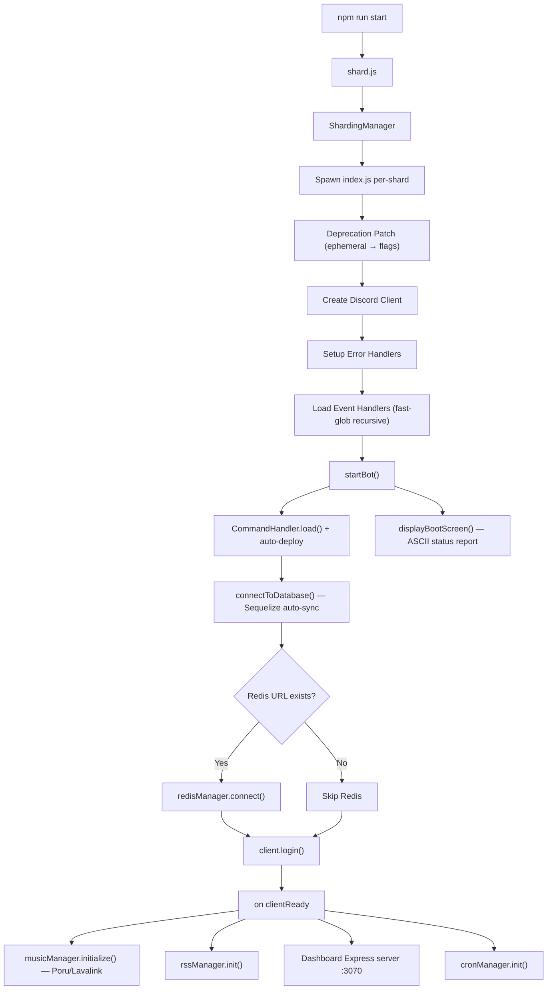
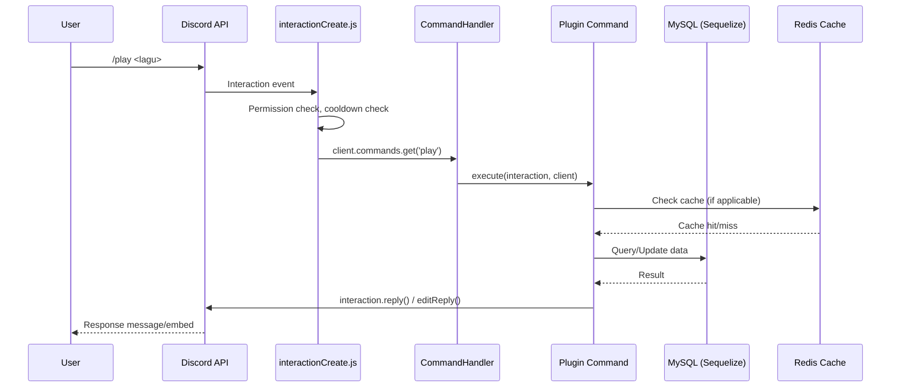
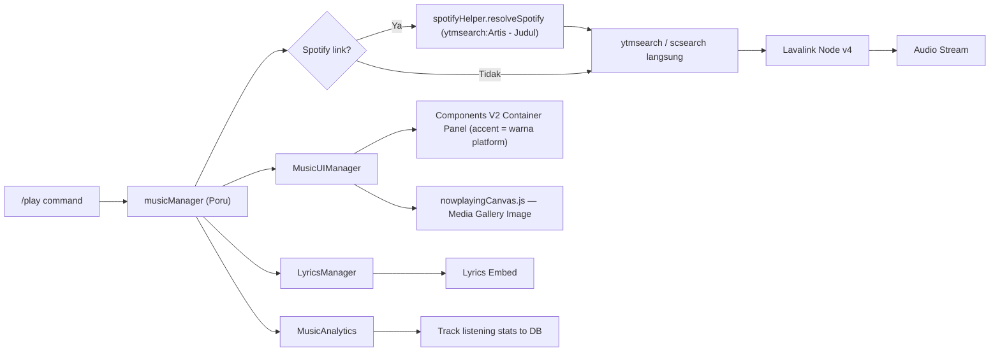
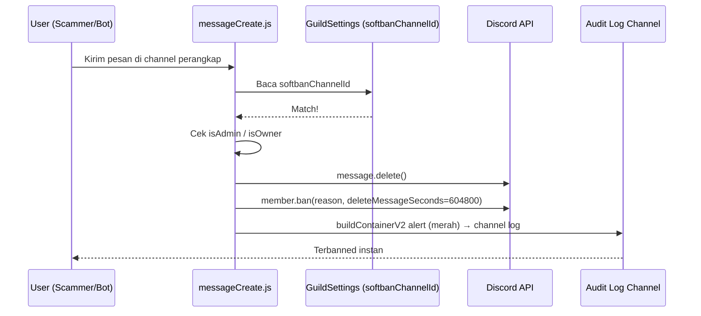

# 🌸 NAURA HOSHINO — Agent Governance & Architecture Guide

> **Versi:** 1.2.0 · **Engine:** 1.1.0 · **Runtime:** Node.js ≥ 24 · **Framework:** discord.js v14

---

## Daftar Isi

1. [File Aturan & Instruksi Global (Governance)](#-bagian-1--aturan--instruksi-global-governance)
2. [File Arsitektur & Rencana Kerja (Map)](#-bagian-2--arsitektur--rencana-kerja-map)
3. [File Proyek & Environment (Context)](#-bagian-3--proyek--environment-context)

---

# 📜 BAGIAN 1 — Aturan & Instruksi Global (Governance)

## 1.1 Bahasa & Konvensi Kode

| Aturan | Penjelasan |
|---|---|
| **Bahasa Kode** | JavaScript (CommonJS `require`/`module.exports`). Tidak menggunakan TypeScript atau ESM. |
| **Bahasa Komentar** | Bahasa Indonesia untuk komentar inline dan log. Bahasa Inggris hanya untuk nama variabel, fungsi, dan kelas. |
| **Indentasi** | 4 spasi (sesuai Prettier config). |
| **Linting** | ESLint v10 + Prettier v3. Jalankan sebelum commit. |
| **Semicolons** | Wajib digunakan di setiap statement. |
| **String** | Gunakan single quotes (`'...'`) untuk string biasa, backticks (`` `...` ``) untuk template literals. |

## 1.2 Aturan Penamaan

| Elemen | Pola | Contoh |
|---|---|---|
| File command/plugin | `kebab-case.js` | `steal-emoji.js`, `warn.js` |
| File manager/utility | `camelCase.js` | `cronManager.js`, `bootScreen.js` |
| File model (Sequelize) | `PascalCase.js` | `UserProfile.js`, `GuildSettings.js` |
| File builder/utility | `PascalCase.js` | `NauraContainerBuilder.js`, `NauraEmbedBuilder.js` |
| Variabel & fungsi | `camelCase` | `cleanEnv()`, `buildContainerV2()` |
| Kelas & model | `PascalCase` | `CommandHandler`, `MusicManager` |
| Konstanta global | `UPPER_SNAKE_CASE` | `OWNER_IDS`, `LAVA_HOST` |
| Event handler files | `camelCase.js` (nama event Discord) | `messageCreate.js`, `voiceStateUpdate.js` |

## 1.3 Aturan Arsitektur

> [!IMPORTANT]
> Patuhi prinsip-prinsip ini saat menambah atau mengubah kode:

1. **Modularitas Plugin** — Setiap fitur command harus berada di folder `/plugin/<kategori>/`. Jangan pernah menulis logic command di dalam file event handler.
2. **Model Terpisah** — Semua definisi Sequelize model HARUS berada di `/src/models/`. Jangan mendefinisikan schema di dalam command atau manager.
3. **Satu File = Satu Tanggung Jawab** — Manager hanya mengelola satu domain (misal: `cronManager.js` hanya untuk cron, `redisManager.js` hanya untuk Redis).
4. **Environment Via `env.js`** — Semua akses `process.env` HARUS melalui `/src/config/env.js`. Jangan pernah memanggil `process.env.XXX` langsung di file lain.
5. **Anti-Crash Wajib** — Setiap operasi async yang berisiko (API call, Canvas render, DB query) harus di-wrap dalam `try/catch`. Global error handler sudah ada di `/src/managers/errorHandler.js`.
6. **Canvas Memory Safety** — Setelah merender canvas (via `@napi-rs/canvas`), pastikan buffer di-dispose untuk mencegah memory leak.
7. **Jangan Hardcode ID** — Channel ID, role ID, dan guild ID harus disimpan di `/src/config.json` atau `GuildSettings` model, bukan di-hardcode dalam kode.
8. **Setup Terpusat** — Seluruh konfigurasi server (Welcome, Automod, Ticket, TempVoice, Softban, dll.) harus diakses hanya melalui `/plugin/admin/setup.js`. File `setup-*.js` terpisah sudah **dihapus** dan tidak boleh dibuat ulang.
9. **Softban Channel via GuildSettings** — Channel Honeypot Scammer Trap disimpan di `GuildSettings.settings.softbanChannelId`. Pengecekan dilakukan paling awal di `messageCreate.js` sebelum proses lain.
10. **Layout Components V2 Wajib** — Setiap Container V2 (baik via `buildContainerV2()` maupun manual) HARUS mengikuti struktur 5-lapisan:
    ```
    [ Header ]
    ───────── separator (divider:true) ─────────
    [ Deskripsi / Fields / Media Gallery ]
    ··········· separator (divider:false) ··········
    [ Select Menu / Tombol ]
    ───────── separator (divider:true) ─────────
    [ Footer ]
    ```
    Footer **SELALU** harus ada. Gunakan `ui.getFooter('core'|'utility'|'survival'|'music')` sebagai default.

## 1.4 Aturan Commit & Branching

| Aturan | Detail |
|---|---|
| Format commit | `<emoji> <tipe>: <deskripsi singkat>` contoh: `✨ feat: tambah command /weather` |
| Tipe commit | `feat`, `fix`, `refactor`, `docs`, `style`, `perf`, `chore` |
| Branching | `main` untuk produksi, `dev` untuk development, `feature/<nama>` untuk fitur baru |

## 1.5 Aturan Keamanan

> [!CAUTION]
> Pelanggaran aturan keamanan ini bisa menyebabkan kebocoran data pengguna.

- **JANGAN PERNAH** meng-commit file `.env` ke repository.
- **JANGAN PERNAH** log-kan token, password, atau API key ke console.
- Semua webhook endpoint (`/api/webhook/*`) HARUS memverifikasi `Authorization` header.
- Rate limiting aktif via `rateLimiter.js` — jangan bypass tanpa alasan kuat.
- Validasi semua input user sebelum diproses (terutama untuk command yang menerima URL atau text panjang).

## 1.6 Panduan Desain UI/UX (Style Guide)

### Identitas Visual

Naura Hoshino menggunakan identitas **Cyber-Anime Glassmorphism** — gabungan estetika anime kawaii dengan antarmuka futuristik. Referensi lengkap ada di `DESIGN.md`.

### Palet Warna Utama

| Token | Hex | Fungsi |
|---|---|---|
| `primary` | `#FFB6C1` | Identitas brand, border panel kaca, glow text |
| `canvas` | `#0B0C10` | Background terdalam (hitam kebiruan) |
| `accent-pink` | `#F9A8D4` | Metrik ping & latensi |
| `accent-purple` | `#C084FC` | Jaringan server, guild stats |
| `accent-blue` | `#93C5FD` | Demografi user |
| `accent-green` | `#86EFAC` | Uptime, status aktif |
| `premium-gold` | `#FFD700` | Sistem premium/VIP, ekonomi |
| `discord-blurple` | `#5865F2` | Tombol OAuth2, link Discord |
| `surface-glass` | `rgba(255,255,255,0.03)` | Panel glassmorphism (+ `blur(16px)`) |

### Tipografi

| Konteks | Font | Contoh Penggunaan |
|---|---|---|
| Angka metrik, nama sistem | **Orbitron** (700) | Ping: `42ms`, total server |
| Body text, navigasi, tombol | **Outfit** (300–700) | Deskripsi, label, button |

### Aturan Canvas (@napi-rs/canvas)

- Kartu level & rank → Glassmorphism + Neon Glow
- Now Playing → Dynamic image canvas real-time
- Profile card → Gold glow untuk VIP
- Selalu gunakan `rounded-lg` minimum (12px). Tidak ada sudut tajam.
- Dispose buffer setelah render selesai.

### Aturan Components V2 (Discord)

> [!IMPORTANT]
> Semua respons command WAJIB menggunakan **Discord Components V2** via `buildContainerV2()` dari `NauraContainerBuilder.js`. Embed lama (`NauraEmbedBuilder` / `EmbedBuilder`) hanya diperbolehkan untuk pesan loading sementara dan error sederhana.

#### Struktur Layout Wajib

Setiap Container V2 harus mengikuti struktur 5-lapisan berikut:

```
[ Header (authorName + title + iconURL) ]
───────── separator (divider:true, spacing:1) ─────────
[ Deskripsi / Fields / Media Gallery / File ]
··········· separator (divider:false, spacing:1) ···········
[ Select Menu / Action Row (Tombol) ]
───────── separator (divider:true, spacing:1) ─────────
[ -# Footer ]
```

> [!NOTE]
> **`buildContainerV2()` sudah menerapkan struktur ini secara otomatis.** Footer **SELALU** muncul — jika `footerText` tidak diisi, diisi otomatis dengan `ui.getFooter('core')`. Blok separator tipis + tombol hanya muncul jika ada `buttonsRow` yang valid.

#### Aturan Lainnya

- **Gunakan `buildContainerV2()`** dari `/src/utils/NauraContainerBuilder.js` sebagai standar UI utama.
- **Wajib sertakan `flags: MessageFlags.IsComponentsV2`** (nilai `32768`) di setiap payload Container V2.
- **Wajib sertakan `embeds: []`** saat meng-edit pesan lama (embed) ke Container V2, agar sisa embed lama dibersihkan oleh Discord PATCH API.
- **Custom emoji di `authorName` dan `footerText`** TIDAK didukung oleh Discord di bagian tersebut. Gunakan `ui.stripCustomEmojis()` sebelum mengisinya. Judul, deskripsi, dan field boleh menggunakan emoji kustom.
- **Footer Terpusat** — Gunakan `ui.getFooter('core' | 'utility' | 'survival' | 'music')` untuk footer semua embed/container. Jangan tulis teks footer secara manual.
- **Tombol dengan custom emoji** — Gunakan `ui.parseEmoji(ui.getEmoji('namaEmoji'))` yang mengembalikan `{ id, name, animated }` sebelum diberikan ke `ButtonBuilder.setEmoji()` agar tidak terjadi `RESTJSONError: Invalid Form Body`.
- **Container Manual (non-`buildContainerV2`)** — Jika membangun container secara manual (seperti `MusicUIManager.js`), WAJIB mengikuti struktur 5-lapisan di atas secara eksplisit menggunakan `separatorComp(true, 1)` dan `separatorComp(false, 1)` dari `NauraContainerBuilder.js`.

### Aturan Embed Discord (Legacy)

- Hanya digunakan untuk pesan loading sementara dan error inline.
- Gunakan `NauraEmbedBuilder` dari `/src/utils/NauraEmbedBuilder.js` jika tetap diperlukan.
- Warna embed default: `#FFB6C1` (primary pink).
- Premium embed: `#FFD700` (gold).
- Error embed: gunakan warna merah standar Discord.

## 1.7 Aturan Migration & Database

> [!IMPORTANT]
> Pelanggaran aturan ini bisa menyebabkan schema yang tidak konsisten antara environment development dan production.

- **ALTER TABLE DILARANG di `dbManager.js`** — Semua migration kolom (`ADD COLUMN`, `MODIFY COLUMN`, `DROP COLUMN`, dll.) harus berada **eksklusif** di `dbMigrator.js` dengan sistem versi bernomor. Tidak boleh ada raw `sequelize.query('ALTER TABLE ...')` di dalam `connectToDatabase()`.
- **Seeding data awal** (CanvasAsset, GameItem, dll.) boleh tetap di `connectToDatabase()`, namun HARUS dipisah ke fungsi `seedInitialData()` yang dipanggil terpisah agar mudah di-test dan tidak bercampur dengan logic koneksi.
- **Gunakan `try/catch` per-migration** di `dbMigrator.js` dengan log yang jelas, bukan silent catch kosong (`catch (e) {}`).

## 1.8 Aturan Memory Safety (Non-Canvas)

> [!CAUTION]
> In-memory Map yang tidak dibersihkan adalah sumber memory leak tersembunyi yang sulit di-debug.

- **Setiap `Map` atau `Set` yang dipakai sebagai in-memory store sementara WAJIB memiliki cleanup mechanism.** Ini berlaku untuk:
  - Rate limiter fallback (`inMemoryStore` di `rateLimiter.js`)
  - Snipe cache (`client.snipes`)
  - DM cooldown maps di event handler
  - Error dedup maps di `errorHandler.js`
- Gunakan salah satu strategi berikut:
  - `setInterval(() => { map.clear(); }, ttl_ms)` untuk full periodic clear
  - Loop selektif: hapus hanya entries yang sudah melewati TTL-nya
- Setiap Map yang dibuat sebagai modul-level constant (di luar class/function) WAJIB didokumentasikan kapan ia di-cleanup.

## 1.9 Aturan Caching Wajib untuk Query Berulang

> [!IMPORTANT]
> Query DB tanpa cache di event handler bervolume tinggi (messageCreate, interactionCreate) sangat membebani database.

- **`GuildSettings` WAJIB di-cache** — Karena `GuildSettings.findOne()` dipanggil di setiap `messageCreate` dan `interactionCreate`, query ini HARUS melewati `cacheManager.getGuildSettings()` atau `redisManager.getOrSetCache()` dengan TTL minimal 5 menit (300 detik).
- **Invalidate cache saat setting berubah** — Setiap kali `/setup` atau command admin mengubah `GuildSettings`, WAJIB memanggil `cacheManager.invalidateGuildSettings(guildId)` untuk menghapus cache lama.
- **Jangan query DB di dalam loop** — Jika perlu data user/guild untuk banyak item sekaligus, gunakan `findAll` dengan `where: { id: { [Op.in]: listOfIds } }` lalu map hasilnya, bukan query satu per satu di dalam loop.
- **`UserProfile` sudah di-cache** via `cacheManager.getUserProfile()` — Selalu gunakan method ini, jangan `UserProfile.findByPk()` langsung di command kecuali ada alasan kuat.

---

# 🗺️ BAGIAN 2 — Arsitektur & Rencana Kerja (Map)

## 2.1 Diagram Arsitektur Tingkat Tinggi

```
┌─────────────────────────────────────────────────────────────────────┐
│                         ENTRY POINTS                                │
│                                                                     │
│  shard.js ─── ShardingManager ──► index.js (per shard)              │
│                                    │                                │
│                                    ├─► Discord Client (discord.js)  │
│                                    ├─► MusicManager (Poru/Lavalink) │
│                                    ├─► RssManager                   │
│                                    ├─► CronManager                  │
│                                    └─► Dashboard (Express:3070)     │
└─────────────────────────────────────────────────────────────────────┘
```

## 2.2 Peta Direktori Lengkap

```
Naura-Hoshino/
├── shard.js                    # 🚀 Entry point utama (ShardingManager)
├── index.js                    # ⚙️ Bot instance per-shard (boot sequence)
├── package.json                # 📦 Dependencies & scripts
├── .env.example                # 🔐 Template environment variables
├── DESIGN.md                   # 🎨 Style guide & design tokens lengkap
│
├── src/                        # 🧠 CORE ENGINE
│   ├── config/
│   │   ├── env.js              #    Centralized env parser & validator
│   │   ├── bot-activity.js     #    Konfigurasi rotating activity/status
│   │   ├── lang.json           #    Mapping bahasa per-guild
│   │   └── ui.js               #    UI constants (emoji, warna, template)
│   │
│   ├── config.json             #    Static config (tempvoice, ticket, minecraft IDs)
│   │
│   ├── events/                 #    📡 Discord Event Handlers (16 files)
│   │   ├── ready.js            #       Bot ready (init cron, presence)
│   │   ├── messageCreate.js    #       Prefix cmd, AI chat, automod, softban trap
│   │   ├── interactionCreate.js#       Slash cmd, buttons, modals, selects
│   │   ├── voiceStateUpdate.js #       TempVoice, music auto-disconnect
│   │   ├── guildMemberAdd.js   #       Welcome canvas, autorole
│   │   ├── guildMemberRemove.js#       Goodbye canvas, sticky roles
│   │   ├── guildMemberUpdate.js#       Vanity role checker
│   │   ├── channelCreate.js    #       Audit log: channel baru
│   │   ├── channelDelete.js    #       Audit log: channel dihapus
│   │   ├── channelUpdate.js    #       Audit log: channel diupdate
│   │   ├── messageDelete.js    #       Snipe cache & audit log
│   │   ├── messageUpdate.js    #       Audit log: pesan diedit
│   │   ├── messageReactionAdd.js#      Reaction role handler
│   │   ├── presenceUpdate.js   #       Vanity status monitor
│   │   ├── roleCreate.js       #       Audit log: role baru
│   │   └── roleDelete.js       #       Audit log: role dihapus
│   │
│   ├── managers/               #    🏗️ Service Managers (16 files)
│   │   ├── CommandHandler.js   #       Auto-load & deploy slash commands (fast-glob recursive)
│   │   ├── EventHandler.js     #       Auto-load event handlers
│   │   ├── dbManager.js        #       Sequelize init, sync, & connection
│   │   ├── dbMigrator.js       #       Auto-migration system
│   │   ├── redisManager.js     #       Redis cache layer
│   │   ├── cacheManager.js     #       In-memory cache with TTL
│   │   ├── cronManager.js      #       Scheduled tasks (daily reset, etc.)
│   │   ├── errorHandler.js     #       Global anti-crash system
│   │   ├── logger.js           #       Colored console logger
│   │   ├── backupManager.js    #       Guild backup system
│   │   ├── rssManager.js       #       RSS feed monitor
│   │   ├── giveawayManager.js  #       Giveaway lifecycle
│   │   ├── languageManager.js  #       Multi-language support
│   │   ├── securityManager.js  #       Anti-nuke & security checks
│   │   ├── shopManager.js      #       In-game shop logic
│   │   └── voiceManager.js     #       TempVoice room management
│   │
│   ├── models/                 #    💾 Sequelize Models (28 files)
│   │   ├── UserProfile.js      #       Master user data (wallet, bank, bio, reputation, vipExpiry)
│   │   ├── UserLeveling.js     #       XP, level, rank per-guild
│   │   ├── UserSurvival.js     #       RPG survival stats (hp, attack, defense, inventory)
│   │   ├── GuildSettings.js    #       Per-guild configuration
│   │   ├── UserPlaylist.js     #       Cloud music playlists
│   │   ├── PremiumVoucher.js   #       VIP voucher system
│   │   ├── UserPet.js          #       Virtual pet (name, type, level, hunger, happiness)
│   │   ├── UserFriend.js       #       Sistem pertemanan
│   │   ├── UserQuest.js        #       Quest tracking
│   │   ├── ModMail.js          #       Tiket modmail
│   │   ├── Giveaway.js         #       Data giveaway
│   │   ├── SocialAlert.js      #       RSS/social notif
│   │   ├── CanvasAsset.js      #       Aset canvas custom
│   │   ├── CryptoMarket.js     #       Data pasar kripto virtual
│   │   ├── GameItem.js         #       Item database game
│   │   ├── GuildClan.js        #       Sistem klan server
│   │   ├── StickyRole.js       #       Sticky roles saat rejoin
│   │   ├── StoryProgress.js    #       Progress cerita RPG
│   │   ├── UserAchievement.js  #       Sistem pencapaian user
│   │   ├── UserBirthday.js     #       Tanggal ulang tahun user
│   │   ├── UserCard.js         #       Kartu koleksi user
│   │   ├── UserChild.js        #       Sistem adopsi anak virtual
│   │   ├── UserCosmetic.js     #       Kosmetik & skin user
│   │   ├── UserCrypto.js       #       Portofolio kripto virtual user
│   │   ├── UserFarm.js         #       Data ladang farming
│   │   ├── UserNPC.js          #       Data relasi NPC per-user
│   │   ├── UserReminder.js     #       Pengingat terjadwal
│   │   └── UserWarn.js         #       Riwayat peringatan moderasi
│   │
│   ├── utils/                  #    🔧 Shared Utilities (8 files)
│   │   ├── NauraEmbedBuilder.js#       Branded embed factory (legacy, untuk error/loading)
│   │   ├── NauraContainerBuilder.js#   ✨ Components V2 builder (STANDAR UI UTAMA)
│   │   ├── bootScreen.js       #       ASCII art boot display
│   │   ├── rateLimiter.js      #       Per-user rate limiting
│   │   ├── automodHelper.js    #       Auto-moderation utilities
│   │   ├── language.js         #       i18n helper functions
│   │   ├── rcon.js             #       Minecraft RCON client
│   │   └── time.js             #       Time formatting utilities
│   │
│   └── dashboard/              #    🌐 Web Dashboard (Express.js)
│       ├── server.js           #       Express app, OAuth2, Socket.IO, API routes
│       ├── public/             #       Static assets (CSS, JS, images)
│       └── views/              #       EJS/HTML templates
│
├── plugin/                     #    🔌 COMMAND MODULES (12 kategori)
│   ├── core/                   #       /ping, /stats, /info, /about, /help, /language
│   │   ├── core.js             #          Main command router
│   │   ├── naura.js            #          Bot personality / owner panel
│   │   └── locales/            #          i18n strings (id.json, en.json)
│   ├── music/                  #       🎵 /play, /queue, /filter, /playlist
│   │   ├── music.js            #          Main music command
│   │   ├── musicManager.js     #          Poru wrapper & node management
│   │   ├── MusicUIManager.js   #          ✨ Now-Playing Components V2 Panel + Canvas Image
│   │   ├── LyricsManager.js    #          Lyrics fetcher
│   │   ├── MusicAnalytics.js   #          Listening stats tracker
│   │   ├── spotifyHelper.js    #          ✨ Spotify URL resolver (ytmsearch default, format: Artis - Judul)
│   │   ├── soundboard.js       #          Sound effects system
│   │   ├── musicButtons.js     #          Button interaction handlers
│   │   ├── trivia-music.js     #          Music quiz game
│   │   └── poru_events/        #          Lavalink event handlers
│   ├── ai/                     #       🤖 /ai chat, /ai imagine (Gemini)
│   │   ├── ai.js               #          Main AI command
│   │   ├── aiManager.js        #          Chat session & memory manager
│   │   ├── aiRouterManager.js  #          Multi-provider routing (Gemini/Verba)
│   │   └── aiHelper.js         #          Prompt templates & safety filters
│   ├── admin/                  #       🛡️ Admin tools (16 files)
│   │   ├── setup.js            #          ✨ Master Setup Dashboard TERPUSAT (greetings, automod, softban,
│   │   │                       #             modmail, ticket, tempvoice, autorole, vanity, minecraft)
│   │   ├── moderation.js       #          Purge, nuke, roleall
│   │   ├── warn.js             #          Sistem peringatan & strike
│   │   ├── lockdown.js         #          Kunci/buka channel/server
│   │   ├── automod.js          #          Automod quick toggle
│   │   ├── announce.js         #          Pengumuman server
│   │   ├── audit.js            #          Audit log manual
│   │   ├── autorole.js         #          Manajemen auto-role
│   │   ├── giveaway.js         #          Sistem giveaway
│   │   ├── nickname.js         #          Manage nickname
│   │   ├── qotd.js             #          Quote of the day
│   │   ├── reactionrole.js     #          Reaction role setup
│   │   ├── slowmode.js         #          Slowmode channel
│   │   ├── steal-emoji.js      #          Steal emoji dari server lain
│   │   ├── sticky.js           #          Sticky message
│   │   └── voicemod.js         #          Moderasi voice channel
│   ├── leveling/               #       📊 /rank, /leaderboard, XP system
│   │   ├── leveling.js         #          Leveling config command
│   │   └── rank.js             #          Rank card & leaderboard
│   ├── survival/               #       ⚔️ RPG economy (30 subcommands)
│   │   ├── survival.js         #          Main command router
│   │   ├── achievementHelper.js#          Achievement unlock logic
│   │   ├── achievementsData.js #          Achievement database
│   │   ├── difficultyHelper.js #          Difficulty scaling helper
│   │   ├── items.js            #          Dynamic item helper
│   │   ├── items_static.js     #          Static item database
│   │   ├── npcs.js             #          NPC definitions
│   │   ├── onboardingHelper.js #          Onboarding wizard helper
│   │   ├── questGenerator.js   #          Procedural quest generation
│   │   ├── storyData.js        #          Story & narrative data
│   │   ├── survivalLeveling.js #          XP & leveling untuk survival
│   │   ├── survivalTime.js     #          Time-based mechanics
│   │   └── subcommands/        #          30 subcommand handlers:
│   │       │                   #          achievements, bank, chop, clan, class,
│   │       │                   #          collect, consume, craft, date, duel,
│   │       │                   #          dungeon, farm, fish, gallery, heist,
│   │       │                   #          house, info, market, mine, npc,
│   │       │                   #          pet, quest, rebirth, rest, shop,
│   │       │                   #          start, story, study, travel, work
│   ├── premium/                #       💎 /vip, voucher, premium perks
│   │   ├── premium.js          #          Premium command
│   │   └── premiumHelper.js    #          Premium check utilities
│   ├── canvas/                 #       🎨 Canvas render engine (13 files)
│   │   ├── Canvas.js           #          Core canvas renderer
│   │   ├── CanvasUtils.js      #          Drawing primitives & effects
│   │   ├── achievementCanvas.js#          Achievement card renderer
│   │   ├── adminCosmetic.js    #          Admin cosmetic management
│   │   ├── battleCanvas.js     #          Battle scene renderer
│   │   ├── canvasHelper.js     #          Asset loading & caching
│   │   ├── cardCanvas.js       #          Generic card template
│   │   ├── cosmetic.js         #          Cosmetic shop command
│   │   ├── duelCanvas.js       #          PvP duel scene renderer
│   │   ├── imageManager.js     #          Image processing pipeline
│   │   ├── nowplayingCanvas.js #          Music now-playing card
│   │   ├── petCanvas.js        #          Pet display card
│   │   └── profileCanvas.js    #          Profile card renderer
│   ├── utility/                #       🔧 /profile, /weather, /translate, dll (32 files)
│   │   └── downloader.js       #          ✨ Media downloader (yt-dlp+FFmpeg+stream timeout, auto-compress)
│   ├── minigames/              #       🎮 /akinator, /hangman, /minesweeper, /minigame
│   │   ├── akinator.js         #          ✨ CA bundle ENOENT patch untuk kontainer Linux
│   │   ├── hangman.js          #          Hangman word game
│   │   ├── minesweeper.js      #          Minesweeper game
│   │   └── minigame.js         #          Mini-game collection hub
│   ├── modmail/                #       📬 Modmail system
│   │   ├── modmail.js          #          Main modmail command
│   │   └── modmailHelper.js    #          Modmail thread management
│   └── owner/                  #       👑 Bot owner commands
│       └── deploy.js           #          Command deployment tool
│
├── language/                   #    🌍 Localization Files
│   ├── id.json                 #       Bahasa Indonesia
│   └── en.json                 #       English
│
└── assets/                     #    🖼️ Static Assets
    ├── core/                   #       Bot branding (logo, avatar)
    ├── dashboard/              #       Dashboard UI assets
    ├── economy/                #       Economy system icons
    ├── fonts/                  #       Custom fonts (Orbitron, Outfit)
    ├── general/                #       General purpose images
    ├── music/                  #       Music player assets
    └── survival/               #       RPG survival game assets
```

## 2.3 Alur Boot Sequence



## 2.4 Alur Request Command (Slash Command)



## 2.5 Alur Sistem Musik



## 2.6 Alur Softban Scammer Trap (Honeypot Channel)



## 2.7 Alur Webhook Premium (Saweria & Top.gg)

`CommandHandler.js` melakukan:
1. **Scan rekursif** folder `/plugin/` menggunakan `fast-glob`
2. Setiap file yang mengekspor `data` (SlashCommandBuilder) + `execute` function dianggap command valid
3. Command di-register ke `client.commands` Collection
4. Jika `shouldDeploy = true`, semua command di-push ke Discord API via REST

### Format File Command

```javascript
// plugin/<kategori>/namaCommand.js
const { SlashCommandBuilder } = require('discord.js');

module.exports = {
    data: new SlashCommandBuilder()
        .setName('command-name')
        .setDescription('Deskripsi command'),

    // Opsional: metadata tambahan
    cooldown: 5,        // detik
    premium: false,     // apakah butuh VIP
    ownerOnly: false,   // apakah hanya owner

    async execute(interaction, client) {
        // Logic command di sini
    }
};
```

## 2.8 Database Schema Overview

Database menggunakan **Sequelize ORM** dengan **MySQL** (fallback SQLite jika MySQL tidak tersedia). Auto-sync saat boot (`sequelize.sync({ alter: true })`). Total: **28 model**.

### Model Utama & Relasinya

| Model | Tabel | Fungsi | Key Fields |
|---|---|---|---|
| `UserProfile` | `user_profiles` | Master data user | `userId`, `wallet`, `bank`, `bio`, `reputation`, `vipExpiry` |
| `UserLeveling` | `user_levelings` | XP & level per-guild | `userId`, `guildId`, `xp`, `level`, `totalXp` |
| `UserSurvival` | `user_survivals` | RPG stats | `userId`, `hp`, `attack`, `defense`, `inventory` |
| `GuildSettings` | `guild_settings` | Config per-server | `guildId`, `language`, `settings` (JSON: softbanChannelId, automod, greetings, dll.) |
| `UserPlaylist` | `user_playlists` | Cloud playlist | `userId`, `name`, `tracks` (JSON) |
| `PremiumVoucher` | `premium_vouchers` | Voucher VIP | `code`, `duration`, `usedBy` |
| `UserPet` | `user_pets` | Virtual pet | `userId`, `name`, `type`, `level`, `hunger`, `happiness` |
| `UserFriend` | `user_friends` | Sistem pertemanan | `userId`, `friendId`, `status` |
| `UserQuest` | `user_quests` | Quest tracking | `userId`, `questId`, `progress`, `completed` |
| `ModMail` | `modmails` | Tiket modmail | `userId`, `guildId`, `channelId`, `status` |
| `Giveaway` | `giveaways` | Data giveaway | `messageId`, `channelId`, `prize`, `endTime` |
| `SocialAlert` | `social_alerts` | RSS/social notif | `guildId`, `platform`, `channelId`, `url` |
| `CanvasAsset` | `canvas_assets` | Aset canvas kustom | `userId`, `type`, `data` |
| `CryptoMarket` | `crypto_markets` | Pasar kripto virtual | `symbol`, `price`, `change` |
| `GameItem` | `game_items` | Item database game | `itemId`, `name`, `type`, `rarity`, `effect` |
| `GuildClan` | `guild_clans` | Sistem klan server | `guildId`, `clanId`, `name`, `members`, `level` |
| `StickyRole` | `sticky_roles` | Sticky roles saat rejoin | `userId`, `guildId`, `roleIds` |
| `StoryProgress` | `story_progresses` | Progress cerita RPG | `userId`, `chapterId`, `flags` |
| `UserAchievement` | `user_achievements` | Sistem pencapaian | `userId`, `achievementId`, `unlockedAt` |
| `UserBirthday` | `user_birthdays` | Tanggal ulang tahun | `userId`, `birthday`, `timezone` |
| `UserCard` | `user_cards` | Kartu koleksi | `userId`, `cardId`, `count` |
| `UserChild` | `user_children` | Adopsi anak virtual | `userId`, `name`, `age`, `happiness` |
| `UserCosmetic` | `user_cosmetics` | Kosmetik & skin | `userId`, `type`, `itemId`, `equipped` |
| `UserCrypto` | `user_cryptos` | Portofolio kripto virtual | `userId`, `symbol`, `amount`, `avgBuyPrice` |
| `UserFarm` | `user_farms` | Data ladang farming | `userId`, `plots`, `lastHarvest` |
| `UserNPC` | `user_npcs` | Relasi NPC per-user | `userId`, `npcId`, `affection`, `lastInteract` |
| `UserReminder` | `user_reminders` | Pengingat terjadwal | `userId`, `channelId`, `message`, `remindAt` |
| `UserWarn` | `user_warns` | Riwayat peringatan moderasi | `userId`, `guildId`, `reason`, `moderatorId` |

---

# 🔧 BAGIAN 3 — Proyek & Environment (Context)

## 3.1 Informasi Proyek

| Property | Value |
|---|---|
| **Nama** | Naura Hoshino Intelligence |
| **Versi** | 1.2.0 |
| **Deskripsi** | Bot Discord multifungsi dengan AI, High-Fidelity Audio, Canvas Modern, Sistem Ekonomi, dan Web Dashboard |
| **Author** | Aryandita Praftian (Ryaa) |
| **License** | ISC |
| **Runtime** | Node.js ≥ 24.0.0 |
| **Framework** | discord.js v14.26+ |
| **Database** | MySQL (primary) / SQLite (fallback) |
| **ORM** | Sequelize v6 |
| **Cache** | Redis v4 (opsional) |
| **Audio** | Poru v5 + Lavalink v4 |
| **AI** | Google Gemini (`@google/genai`) + Verba (opsional) |
| **Canvas** | `@napi-rs/canvas` v0.1.53 |
| **Web Server** | Express v4 + Socket.IO v4 |

## 3.2 NPM Scripts

| Script | Command | Fungsi |
|---|---|---|
| `npm run start` | `node shard.js` | Menjalankan bot via ShardingManager (produksi) |
| `npm run deploy` | `node index.js --deploy` | Deploy slash commands ke Discord API |
| `npm run install-start` | `npm install && node shard.js` | Fresh install + start |

## 3.3 Environment Variables

> [!WARNING]
> Variabel bertanda ⚠️ **WAJIB** diisi. Bot akan crash jika kosong.

### Discord Core

| Variable | Wajib | Default | Deskripsi |
|---|---|---|---|
| `DISCORD_TOKEN` | ⚠️ | — | Token bot Discord |
| `CLIENT_ID` | ⚠️ | — | Application/Client ID Discord |
| `PREFIX` | ❌ | `n!` | Prefix command legacy |
| `OWNER_IDS` | ❌ | — | ID owner, comma-separated |
| `GUILD_ID` | ❌ | — | ID guild untuk development |

### Version

| Variable | Wajib | Default | Deskripsi |
|---|---|---|---|
| `BOT_VERSION` | ❌ | `1.2.0` | Versi bot yang ditampilkan |
| `ENGINE_VERSION` | ❌ | `1.1.0` | Versi engine internal |

### Database (MySQL)

| Variable | Wajib | Default | Deskripsi |
|---|---|---|---|
| `MYSQL_HOST` | ❌ | `127.0.0.1` | Host database |
| `MYSQL_PORT` | ❌ | `3306` | Port database |
| `MYSQL_USER` | ⚠️ | — | Username database |
| `MYSQL_PASSWORD` | ❌ | — | Password database |
| `MYSQL_DATABASE` | ⚠️ | — | Nama database |

### Web Dashboard & OAuth2

| Variable | Wajib | Default | Deskripsi |
|---|---|---|---|
| `DISCORD_CLIENT_SECRET` | ❌ | — | OAuth2 client secret |
| `DISCORD_CALLBACK_URL` | ❌ | `http://localhost:3070/auth/discord/callback` | OAuth2 redirect URL |
| `SESSION_SECRET` | ❌ | — | Secret key untuk Express session |

### Lavalink (Music)

| Variable | Wajib | Default | Deskripsi |
|---|---|---|---|
| `LAVALINK_HOST` | ❌ | `localhost` | Hostname Lavalink node |
| `LAVALINK_PORT` | ❌ | `2333` | Port Lavalink node |
| `LAVALINK_PASSWORD` | ❌ | `youshallnotpass` | Password Lavalink |
| `LAVALINK_SECURE` | ❌ | `false` | Gunakan SSL/TLS |

### API Keys

| Variable | Wajib | Default | Deskripsi |
|---|---|---|---|
| `GEMINI_API_KEY` | ❌ | — | Google Gemini AI API key |
| `OMDB_API_KEY` | ❌ | — | OMDB (movie database) API key |
| `SPOTIFY_CLIENT_ID` | ❌ | — | Spotify API client ID |
| `SPOTIFY_CLIENT_SECRET` | ❌ | — | Spotify API client secret |

### Verba AI (Opsional)

| Variable | Wajib | Default | Deskripsi |
|---|---|---|---|
| `VERBA_API_KEY` | ❌ | — | Verba AI API key |
| `VERBA_SLUG_OWNER` | ❌ | — | Slug karakter untuk owner |
| `VERBA_SLUG_PREMIUM` | ❌ | — | Slug karakter untuk premium user |
| `VERBA_SLUG_GENERAL` | ❌ | — | Slug karakter untuk general user |
| `VERBA_CHARACTER_SLUG` | ❌ | — | Legacy fallback slug |

### Infrastructure

| Variable | Wajib | Default | Deskripsi |
|---|---|---|---|
| `REDIS_URL` | ❌ | — | Redis connection URL |
| `ERROR_WEBHOOK_URL` | ❌ | — | Discord webhook untuk error reporting |

## 3.4 Infrastruktur & Dependensi Eksternal

### Services yang Dibutuhkan

```
┌──────────────────────────────────────────────────────────────┐
│                    Naura Hoshino Runtime                      │
│                                                              │
│  ┌─────────────┐  ┌──────────────┐  ┌──────────────────┐    │
│  │  Discord API │  │  MySQL/Maria │  │  Lavalink v4     │    │
│  │  (WAJIB)     │  │  DB (WAJIB)  │  │  + LavaSrc       │    │
│  │              │  │              │  │  + SponsorBlock   │    │
│  └─────────────┘  └──────────────┘  └──────────────────┘    │
│                                                              │
│  ┌─────────────┐  ┌──────────────┐  ┌──────────────────┐    │
│  │  Redis       │  │  Google      │  │  Spotify API     │    │
│  │  (Opsional)  │  │  Gemini API  │  │  (Opsional)      │    │
│  │              │  │  (Opsional)  │  │                  │    │
│  └─────────────┘  └──────────────┘  └──────────────────┘    │
└──────────────────────────────────────────────────────────────┘
```

### Dependensi Utama (package.json)

| Package | Versi | Fungsi |
|---|---|---|
| `discord.js` | ^14.26.4 | Framework bot Discord |
| `sequelize` | ^6.37.8 | ORM untuk MySQL/SQLite |
| `mysql2` | ^3.9.7 | MySQL driver |
| `sqlite3` | ^6.0.1 | SQLite fallback driver |
| `redis` | ^4.7.1 | Redis client |
| `poru` | ^5.3.0 | Lavalink audio client |
| `@google/genai` | ^1.46.0 | Google Gemini AI SDK |
| `@napi-rs/canvas` | ^0.1.53 | Canvas rendering (native) |
| `express` | ^4.18.2 | Web server dashboard |
| `socket.io` | ^4.8.3 | Real-time dashboard updates |
| `passport-discord` | ^0.1.4 | Discord OAuth2 |
| `axios` | ^1.6.8 | HTTP client |
| `fast-glob` | ^3.3.3 | File pattern matching |
| `node-cron` | ^4.5.0 | Cron job scheduler |
| `tesseract.js` | ^7.0.0 | OCR engine |
| `msedge-tts` | ^1.1.0 | Text-to-speech |

## 3.5 Static Config (`src/config.json`)

File ini menyimpan ID yang spesifik per-deployment:

```json
{
  "tempvoice": {
    "enabled": true,
    "triggerChannelId": "...",
    "categoryId": "...",
    "panelEmbedColor": "#D8A8FB"
  },
  "ticket": {
    "enabled": true,
    "categoryId": "...",
    "logChannelId": "...",
    "roleAdminId": "...",
    "panelEmbedColor": "#FDBB44"
  },
  "minecraft": {
    "ip": "play.vermiluonserver.my.id",
    "port": 25565,
    "panelEmbedColor": "#3EFC54"
  }
}
```

## 3.6 Sistem Lokalisasi (i18n)

Bot mendukung multi-bahasa via file JSON di `/language/`:
- `id.json` — Bahasa Indonesia (default)
- `en.json` — English

Bahasa per-guild disimpan di `GuildSettings.language`. Akses via `languageManager.js` dan helper `language.js`.

### Format Translation Key

```json
{
  "lang_success": "✅ Bahasa berhasil diubah ke Bahasa Indonesia.",
  "hello": "Halo {user}! Naura siap membantu~",
  "ping": "🏓 Pong! Latensi Naura saat ini {ms}ms.",
  "music_play": "🎵 Asik! Naura akan memutar **{song}** untukmu~"
}
```

Placeholder menggunakan format `{variable}` yang di-replace saat runtime.

## 3.7 Dashboard Web

Dashboard berjalan di **port 3070** (default) menggunakan Express.js:

| Endpoint | Method | Fungsi |
|---|---|---|
| `/` | GET | Landing page dashboard |
| `/auth/discord` | GET | OAuth2 login via Discord |
| `/auth/discord/callback` | GET | OAuth2 callback handler |
| `/api/stats` | GET | Bot statistics (JSON) |
| `/api/webhook/saweria` | POST | Saweria donation webhook |
| `/api/webhook/vote` | POST | Top.gg vote webhook |

Dashboard menggunakan **Socket.IO** untuk real-time updates pada metrik telemetri.

## 3.8 Catatan Deployment

> [!NOTE]
> Informasi penting untuk deployment di production.

1. **Pterodactyl Compatibility** — `env.js` memiliki `cleanEnv()` untuk membersihkan tanda kutip dari panel Pterodactyl.
2. **Auto-Migration** — Sequelize akan otomatis membuat/alter tabel saat boot pertama (`sync({ alter: true })`).
3. **Graceful Shutdown** — Bot menangani `SIGINT` dan `SIGTERM` untuk menutup semua koneksi (Lavalink, MySQL, Redis, Discord) dengan aman.
4. **Auto-Respawn** — `ShardingManager` dikonfigurasi dengan `respawn: true` untuk otomatis restart shard yang crash.
5. **Deprecation Patch** — `index.js` memiliki monkey-patch untuk mengkonversi `ephemeral: true` (deprecated di discord.js terbaru) ke `flags: ['Ephemeral']` secara otomatis.

---

> *Dokumen ini di-generate sebagai panduan lengkap untuk agent dan developer yang bekerja pada ekosistem Naura Hoshino. Untuk detail visual dan design tokens, lihat [DESIGN.md]*
