<div align="center">


# \u2728 Naura Hoshino V.2 \u2728

**Bot Discord multifungsi dengan UI Canvas modern, ekosistem survival, musik Lavalink, AI, dan Web Dashboard.**

[](https://nodejs.org)
[](https://discord.js.org)
[](https://www.mysql.com)
[](https://redis.io)

[](https://lavalink.dev)
[](#-sistem-bilingual)
[](LICENSE)
[](TODO.md)

</div>

> [!NOTE]
> Proyek ini sedang dikembangkan aktif. Beberapa modul masih dirapikan, daftarnya ada di `TODO.md`.

---

## \ud83e\udde9 Fitur Utama

| | Modul | Isi singkat |
| :--: | --- | --- |
| \ud83c\udf31 | **Survival** | Berkebun, menambang, dungeon, klan, pernikahan, dan NPC yang bisa disapa |
| \ud83c\udfae | **Minigame** | Trivia AI, wordle, duel, akinator, hangman, memory, truth or dare |
| \ud83c\udfb5 | **Musik** | Lavalink v4, lirik langsung, dan panel kendali interaktif |
| \ud83e\udd16 | **AI** | Gemini sebagai otak utama, Ollama sebagai cadangan lokal |
| \ud83d\udc8e | **Premium** | Tiga tingkatan V.I.P dengan kartu Canvas dan voucher |
| \ud83d\udee1\ufe0f | **Moderasi** | Automod, ModMail, starboard, giveaway, dan audit log |
| \ud83c\udf10 | **Dashboard** | Panel web Express untuk pengaturan server |

---

## \u2699\ufe0f Kebutuhan Sistem

| Komponen | Versi | Keterangan |
| --- | --- | --- |
| \ud83d\udfe2 Node.js | **>= 20.6.0** | Wajib, karena kode memakai `process.loadEnvFile()` |
| \ud83d\udd35 MySQL | 8.x | Basis data utama, tersedia cadangan SQLite |
| \ud83d\udd34 Redis | opsional | Caching, dilewati bila `REDIS_URL` kosong |
| \ud83d\udfe1 Lavalink | v4 | Khusus fitur musik |
| \u26aa FFmpeg | terbaru | Sudah tersedia lewat `ffmpeg-static` |

> [!WARNING]
> Beberapa dependensi bersifat native (`@napi-rs/canvas`, `sqlite3`, `libsodium-wrappers`). Di Linux kamu mungkin perlu memasang `build-essential` dan `python3` lebih dulu.

---

## \ud83d\ude80 Instalasi

```bash
git clone https://github.com/Aryandita/Naura-Hoshino-V.2.git
cd Naura-Hoshino-V.2
npm install
cp .env.example .env   # lalu isi nilainya
npm start
```

### \ud83d\udce6 Script yang tersedia

| Perintah | Fungsi |
| --- | --- |
| `npm start` | Menjalankan bot lewat ShardingManager (`shard.js`) \u2014 **cara produksi** |
| `npm run dev` | Sama seperti di atas, dengan auto-restart `--watch` |
| `npm run deploy` | Memaksa registrasi ulang slash command |
| `npm run lint` | Menjalankan ESLint |
| `npm run lint:fix` | ESLint dengan perbaikan otomatis |
| `npm run format` | Merapikan format dengan Prettier |
| `npm run locales:check` | Audit paritas kunci bahasa ID vs EN |

> [!TIP]
> Slash command dideploy otomatis saat boot oleh **shard utama saja**. Tambahkan `--no-deploy` untuk melewatinya.

---

## \ud83d\udd10 Konfigurasi Environment

Nama variabel berikut adalah yang benar-benar dibaca oleh `src/config/env.js`.

### \u2757 Wajib

| Variabel | Keterangan |
| --- | --- |
| `DISCORD_TOKEN` | Token bot dari Discord Developer Portal |
| `CLIENT_ID` | Application ID bot |
| `MYSQL_USER` | Username database |
| `MYSQL_DATABASE` | Nama database |

Bot berhenti sebelum shard di-spawn bila salah satu di atas kosong.

<details>
<summary><b>\ud83d\udcac Discord</b></summary>

| Variabel | Default | Keterangan |
| --- | --- | --- |
| `PREFIX` | `n!` | Prefix perintah teks |
| `GUILD_ID` | \u2014 | Server untuk deploy command instan saat pengembangan |
| `OWNER_IDS` | \u2014 | Daftar ID owner, dipisah koma |
| `STAFF_GUILD_ID` | \u2014 | Server staf untuk ModMail |
| `MODMAIL_CATEGORY_ID` | \u2014 | Kategori channel ModMail |

</details>

<details>
<summary><b>\ud83d\uddc4\ufe0f Database & Cache</b></summary>

| Variabel | Default |
| --- | --- |
| `MYSQL_HOST` | `127.0.0.1` |
| `MYSQL_PORT` | `3306` |
| `MYSQL_PASSWORD` | \u2014 |
| `REDIS_URL` | \u2014 (Redis dilewati bila kosong) |

</details>

<details>
<summary><b>\ud83c\udfb5 Musik (Lavalink)</b></summary>

| Variabel | Default |
| --- | --- |
| `LAVALINK_HOST` | `localhost` |
| `LAVALINK_PORT` | `2333` |
| `LAVALINK_PASSWORD` | `youshallnotpass` |
| `LAVALINK_SECURE` | `false` |

</details>

<details>
<summary><b>\ud83e\udd16 AI</b></summary>

| Variabel | Default | Keterangan |
| --- | --- | --- |
| `GEMINI_API_KEY` | \u2014 | Penyedia AI utama |
| `VERBA_API_KEY` | \u2014 | Persona AI |
| `VERBA_SLUG_OWNER` / `VERBA_SLUG_PREMIUM` / `VERBA_SLUG_GENERAL` | \u2014 | Slug persona per tingkatan |
| `OLLAMA_BASE_URL` | `http://localhost:11434` | Cadangan AI lokal |
| `OLLAMA_MODEL` | `llama3.1` | Model Ollama |
| `FOOOCUS_BASE_URL` | `http://localhost:7865` | Generasi gambar lokal |

</details>

<details>
<summary><b>\ud83c\udf10 Dashboard & Webhook</b></summary>

| Variabel | Default | Keterangan |
| --- | --- | --- |
| `PORT` / `SERVER_PORT` / `DASHBOARD_PORT` | `3070` | Port dashboard, sesuai urutan prioritas |
| `WEBHOOK_PORT` | `3071` | Port penerima webhook |
| `SESSION_SECRET` | \u2014 | **Wajib diisi di produksi** |
| `DISCORD_CALLBACK_URL` | \u2014 | Callback OAuth2 |
| `ERROR_WEBHOOK_URL` | \u2014 | Webhook laporan error |
| `WEBHOOK_AUTH_SAWERIA` | \u2014 | Token webhook Saweria |
| `WEBHOOK_AUTH_VOTE` | \u2014 | Token webhook Top.gg |

</details>

<details>
<summary><b>\u2b50 Metadata</b></summary>

| Variabel | Default |
| --- | --- |
| `BOT_VERSION` | `1.2.0` |
| `ENGINE_VERSION` | `1.1.0` |
| `PARTNERSHIP` | `Belum ada kolaborasi` |

</details>

---

## \ud83d\uddc2\ufe0f Struktur Proyek

```
.
\u251c\u2500 index.js               # Proses bot (satu per shard)
\u251c\u2500 shard.js               # ShardingManager, titik masuk produksi
\u251c\u2500 assets/                # Gambar, font, aset Canvas
\u2502  \u2514\u2500 Naura_Expression/   # 15 ekspresi Naura untuk embed
\u251c\u2500 language/              # Kamus bahasa utama (id.json, en.json)
\u251c\u2500 plugin/                # Perintah, dikelompokkan per kategori
\u2502  \u2514\u2500 <kategori>/locales/ # Kamus bahasa khusus plugin
\u251c\u2500 scripts/               # Perkakas pemeliharaan
\u2514\u2500 src/
   \u251c\u2500 config/             # env.js, ui.js, konfigurasi statis
   \u251c\u2500 dashboard/          # Web Dashboard (Express)
   \u251c\u2500 events/             # Event listener Discord
   \u251c\u2500 managers/           # Database, cache, cron, bahasa, logger
   \u251c\u2500 models/             # Model Sequelize
   \u2514\u2500 utils/              # Builder embed/container dan helper
```

### Alur Boot

```mermaid
flowchart LR
    A[shard.js] --> B[index.js]
    B --> C[applyEphemeralPatch]
    C --> D[applyLocalePatch]
    D --> E[validateEnv]
    E --> F[Client discord.js]
    F --> G[loadEvents]
    G --> H[CommandHandler]
    H --> I[MySQL + Redis]
    I --> J[cronManager]
    J --> K[Bot siap]

    style A fill:#5865F2,color:#fff
    style D fill:#FFB703,color:#000
    style I fill:#00758F,color:#fff
    style K fill:#2ECC71,color:#fff
```



---

## \ud83c\udf0f Sistem Bilingual

Naura berbicara dalam Bahasa Indonesia dan Inggris. Pilihan bahasa disimpan pada kolom `language` di tabel `user_profiles` dan berlaku di seluruh ekosistem.

```js
const lang = require('./src/managers/languageManager');

await lang.setUserLanguage(userId, 'en');            // simpan pilihan
const text = await lang.translate(userId, 'help.title');
const sync = lang.translateSync('en', 'greeting', { name: 'Ryaa' });
```

Setiap objek interaksi dan pesan juga sudah ditambal otomatis, jadi di dalam plugin kamu cukup menulis:

```js
await interaction.reply(interaction.t('lang_success'));
```

Kamus utama ada di `language/`, kamus khusus plugin di `plugin/<kategori>/locales/`. Bila ada kunci yang bentrok, kamus utama menang. Jalankan `npm run locales:check` untuk melihat kunci yang belum diterjemahkan.

---

## \ud83c\udfa8 Ekspresi Naura

Setiap balasan bisa menampilkan wajah Naura sesuai suasana hatinya.

```js
const naura = require('./src/utils/nauraExpression');

const { embed, files } = naura.decorate(myEmbed, 'success');
await interaction.reply({ embeds: [embed], files });
```

| Mood | Ekspresi | Dipakai saat |
| --- | --- | --- |
| `success` | Cheers | Perintah berhasil |
| `loading` | Thinking | Sedang memproses |
| `error` | Cry | Terjadi kesalahan |
| `cooldown` | Sleepy | Waktu habis atau menunggu |
| `levelup` | Impressed | Naik level atau meraih prestasi |
| `music` | Chirping | Pemutar musik aktif |

Daftar lengkapnya ada di `src/utils/nauraExpression.js`.

---

<div align="center">

## \ud83d\udcdc Lisensi

ISC \u00a9 2026 **Aryandita Praftian** \u2014 lihat berkas [`LICENSE`](LICENSE).

<sub>Dibuat dengan sabar, kopi, dan senyum Naura \u2728</sub>

</div>
